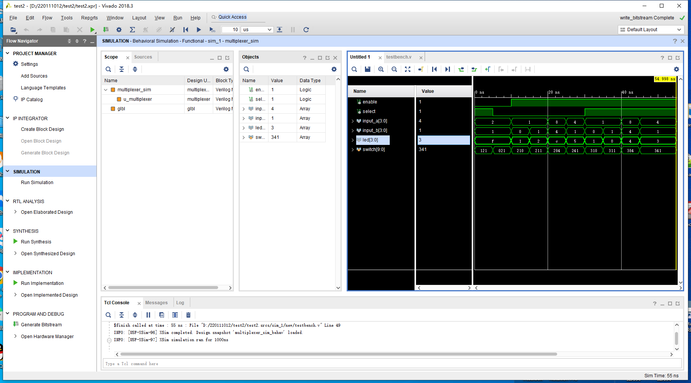
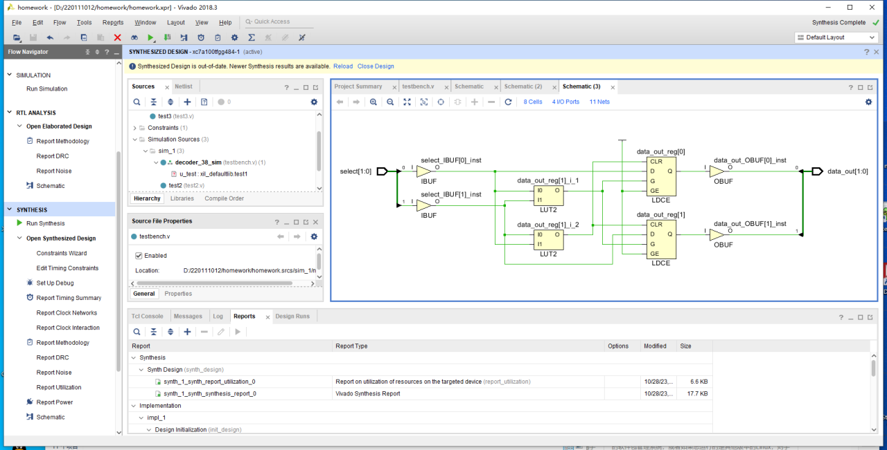
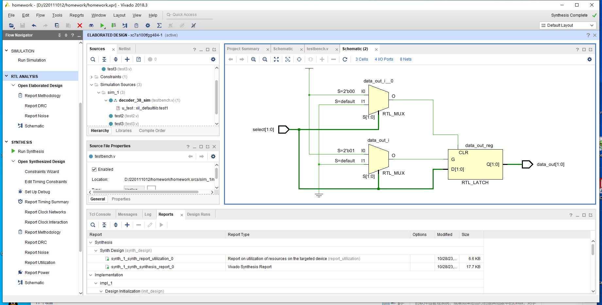
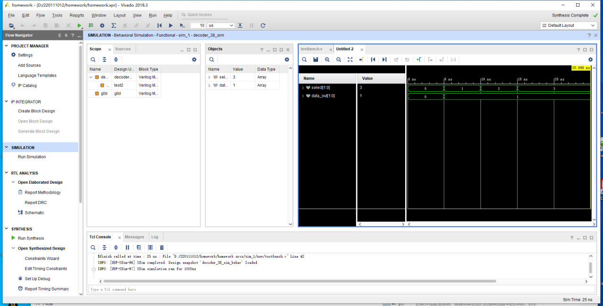
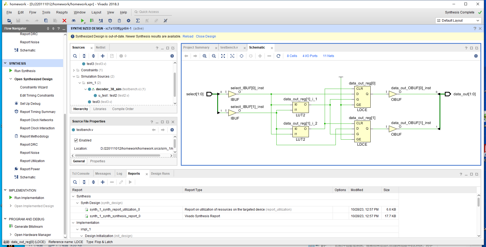
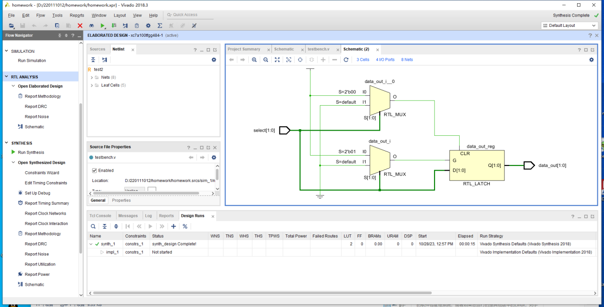
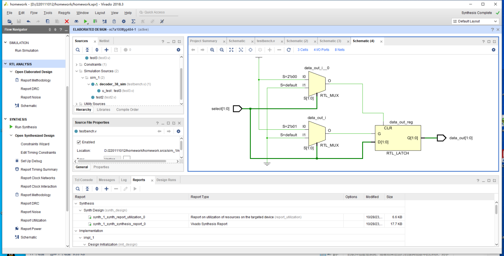

# 实验报告

mux的波形如下：



波形分析：

mux 模块完成题目要求的功能，输入有使能enable、选择select, 数据input_a, input_b，输出为 led。从上述波形可以看出：

1. enable为0, input_a, input_b, select无论为多少，输出led均为为f(4'b1111)，符合预期;
2. 同上
3. enable=1, select=0(input_a + input_b), input_a=1, input_b=0, 输出led=1, 符合预期;
4. enable=1, select=0(input_a + input_b), input_a=1, input_b=1, 输出led=2, 符合预期;
5. enable=1, select=0(input_a + input_b), input_a=8, input_b=4, 输出led=12(0xc), 符合预期;
6. enable=1, select=0(input_a + input_b), input_a=4, input_b=1, 输出led=5, 符合预期;
7. enable=1, select=1(input_a - input_b), input_a=1, input_b=0, 输出led=1, 符合预期;
8. enable=1, select=1(input_a - input_b), input_a=1, input_b=1, 输出led=0, 符合预期;
9. enable=1, select=1(input_a - input_b), input_a=8, input_b=4, 输出led=4, 符合预期;
10. enable=1, select=1(input_a - input_b), input_a=4, input_b=1, 输出led=3, 符合预期;

故根据上述分析，mux模块实现了以下功能:

```verilog
if (enable){
    if (select) {
        let = input_a - input_b
    } else {
        let = input_a + input_b
    }
} else {
    led = 4'b1111
}
```

RTL


 综合


## test1

仿真


synthesis



RTL



## test2

仿真



synthesis



RTL



## test3

仿真


synthesis


RTL



## 综上

- RTL: 可以看到, 三张图RTL得到的网表是相同的, 毕竟这三个test的效果是一样的

- 综合: 这里是用了一些fpga的元件, 查表表等, 因为select有两位, 将两位分开, 然后分别进行查找表, 然后根据每一位的查找表, 得到data_out中的高低位

- 仿真: 可以看到, test2中应该是出现了错误, 在select = 1, 2, 3的时候, date_out一直只是1, 问题应该是他最后的if else, 而不是像test3那样, 最后只有一个else, 这是因为综合出了latch
