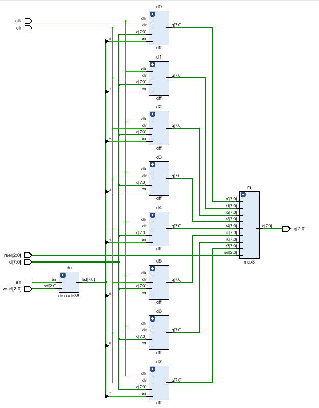
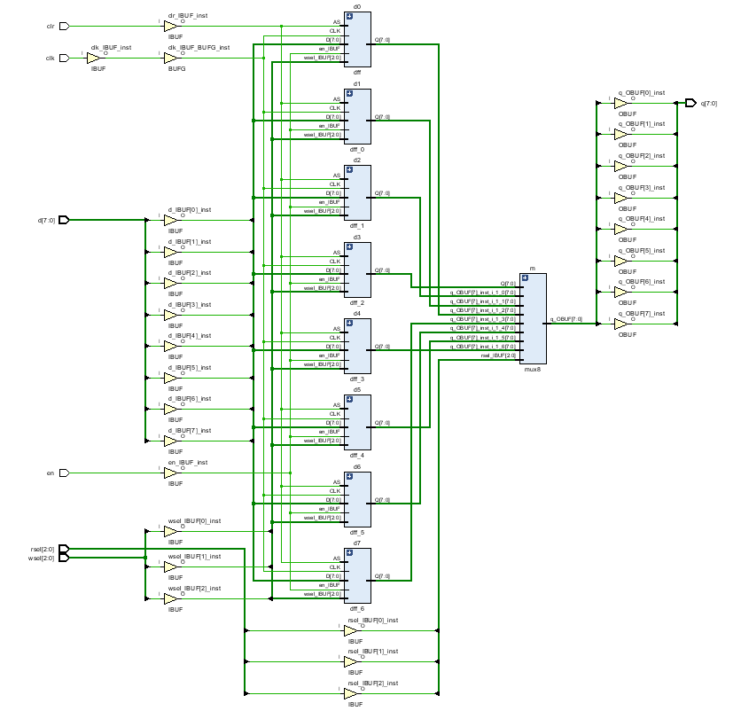

# 8位寄存器堆

## 仿真波形图分析

## RTL analaysis

(1) 0~10ns没反应

(2) 20ns，结束初始化，所有的寄存器里面装的都是ff

(3) 25ns，clk上升沿，wsel=5，rsel=5，d=aa，q(r5)=aa，r5=aa，其他都是ff

(4) 35ns，clk上升沿，wsel=2，rsel=1，d=10，q(r1)=ff，r5=aa，r2=10，其他都是ff

(5) 45ns，clk上升沿，wsel=1，rsel=2，d=a0，q(r2)=10，r5=aa，r2=10，r1=a0，其他都是ff

(6) 55ns，clk上升沿，wsel=2，rsel=2，d=01，q(r2)=01，r5=aa，r2=01，r1=a0，其他都是ff

(7) 65ns，clk上升沿，wsel=6, rsel=2, d=20, q(r2)=01, r5=aa, r2=01, r1=a0, r6=20, 其他都是ff

(8) 75ns，clk上升沿，wsel=3, rsel=1, d=20, q(r1)=a0, r5=aa, r2=01, r3=20, r1=a0, r6=20, 其他都是ff

(9) 85ns, clr启动复位，所有的寄存器变为ff

(10) 95ns, 105ns, 115ns, 125ns, clk上升沿，wsel=0, rsel=1/2/3，读取这些寄存器，这些寄存器存的都是ff

## Synthesis analysis

# 课后作业

(1) 0~5ns没反应

(2) 5~15ns初始化，rst=1，设置复位，a=b=c=0

(3) 15ns，clk上升沿，test中的a=2，b=0，c=0

(4) 25ns，clk上升沿，test中的a=2，b=3，c=0

(5) 35ns，clk上升沿，test中的a=2，b=3，c=4

(6) 45ns，clk上升沿（同步复位），设置a=b=c=0

(7) 55ns，clk上升沿，test中的a=2，b=0，c=0

(8) 65ns，clk上升沿，test中的a=2，b=3，c=0

(9) 75ns，clk上升沿，test中的a=2，b=3，c=4

最后没有给其他信号，就一直都是`data_out=c=4`

