# lab3

### rtl

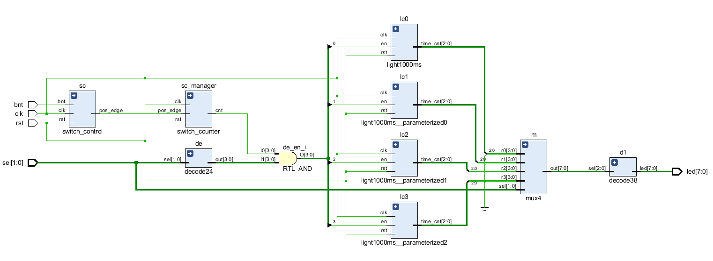

### syn

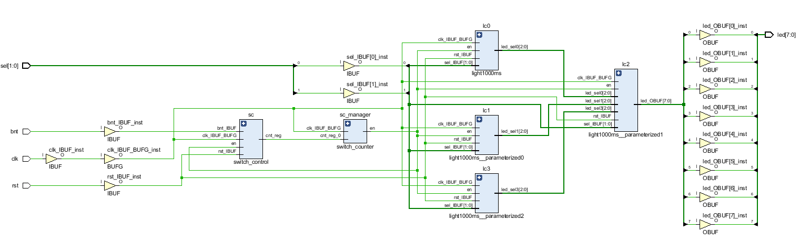

### sim

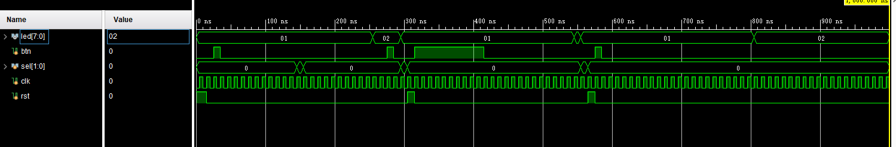

(1) 15ns 结束时，rst=1 结束，完成初始化

(2) 25ns 结束时，btn=1 结束，内部计数器开始计时

(3) 145ns ~ 155ns 时，sel=1，并没有使 led 变化

(4) 255ns ~ 275ns 时，led=2，计数器满了

(5) 275ns ~ 285ns 时，btn=1，计时暂停

(6) 295ns ~ 305ns 时，sel=1，并没有使 led 变化

(7) 305ns ~ 315ns 时，rst=1，复位

(8) 315ns ~ 415ns 时，btn=1，开始计数

(9) 545ns ~ 555ns 时，led=2，计数器满了

(10) 555ns ~ 565ns 时，sel=1，led 重新变为 1

(11) 565ns ~ 575ns 时，rst=1，复位，led 变为 1

(12) 575ns ~ 585ns 时，btn=1，开关按下，开始计数

(13) 805ns 时，计数器满了，led=2

# 课后作业

## block1

### RTL

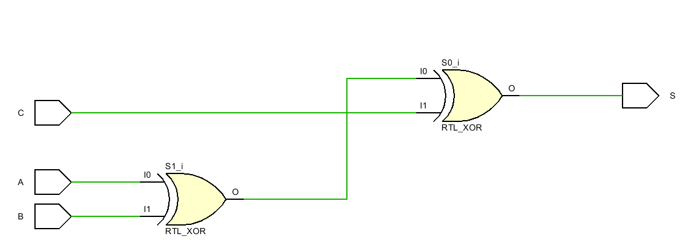

### Synthesis

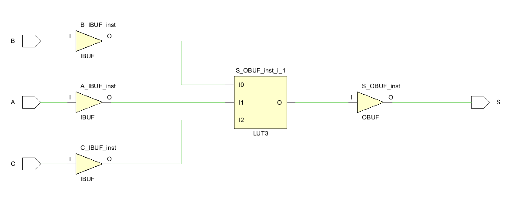

### sim

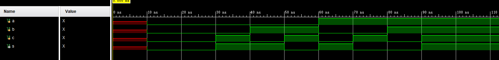

(1) 30ns 结束时, a = b = c = 0; s = 0(n1 = a ^ b, s = n1 ^ c)

(2) 40ns 结束时, a = 0, b = 0, c = 1; s = 1(n1 = a ^ b, s = n1 ^ c)

(3) 50ns 结束时, a = 0, b = 1, c = 0; s = 1(n1 = a ^ b, s = n1 ^ c)

(4) 60ns 结束时, a = 0, b = 1, c = 1; s = 0(n1 = a ^ b, s = n1 ^ c)

(5) 70ns 结束时, a = 1, b = 0, c = 0; s = 1(n1 = a ^ b, s = n1 ^ c)

(6) 80ns 结束时, a = 1, b = 0, c = 1; s = 0(n1 = a ^ b, s = n1 ^ c)

(7) 90ns 结束时, a = 1, b = 1, c = 0; s = 0(n1 = a ^ b, s = n1 ^ c)

(8) 100ns 结束时, a = 1, b = 1, c = 1; s = 1(n1 = a ^ b, s = n1 ^ c)

## unblock1

### rtl

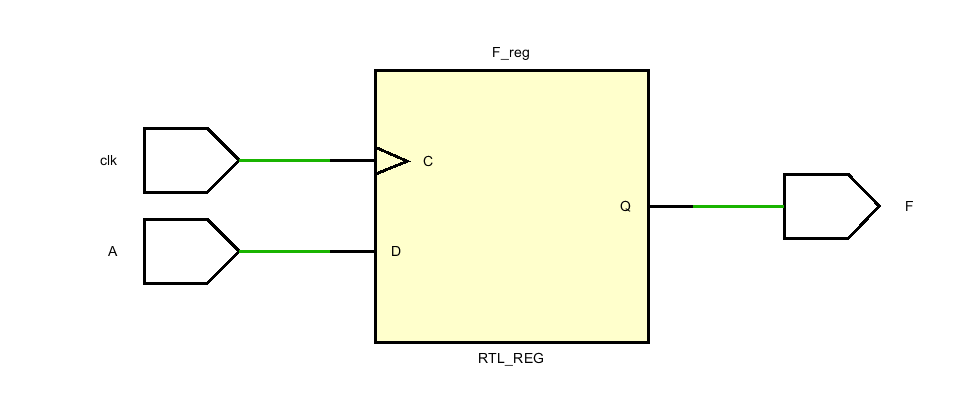

### synthesis

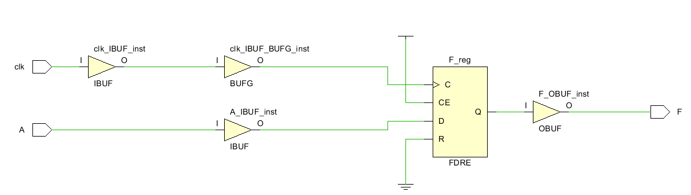

### sim

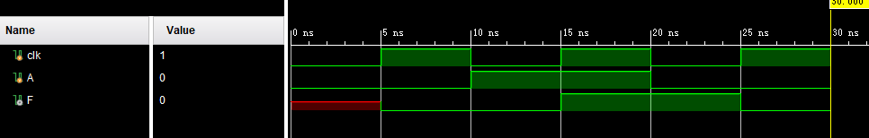

(1) 30ns 结束时, a = b = c = 0; n1 = 0(n1 <= a ^ b), s = x(s <= n1 ^ c)

(2) 40ns 结束时, a = 0, b = 0, c = 1; n1 = 0(n1 <= a ^ b), s = 1(s <= n1 ^ c)

(3) 50ns 结束时, a = 0, b = 1, c = 0; n1 = 1(n1 <= a ^ b), s = 0(s <= n1 ^ c)

(4) 60ns 结束时, a = 0, b = 1, c = 1; n1 = 1(n1 <= a ^ b), s = 0(s <= n1 ^ c)

(5) 70ns 结束时, a = 1, b = 0, c = 0; n1 = 1(n1 <= a ^ b), s = 1(s <= n1 ^ c)

(6) 80ns 结束时, a = 1, b = 0, c = 1; n1 = 1(n1 <= a ^ b), s = 0(s = n1 ^ c)

(7) 90ns 结束时, a = 1, b = 1, c = 0; n1 = 0(n1 <= a ^ b), s = 1(s = n1 ^ c)

(8) 100ns 结束时, a = 1, b = 1, c = 1; n1 = 0(n1 <= a ^ b), s = 1(s = n1 ^ c)

## block2

### rtl

### synthesis

### sim

(1) 5ns 结束时, a = 0; b = 0; f = x

(2) 15ns 结束时, a = 1; b = 1(b = a); f = 1(f = b)

(2) 25ns 结束时, a = 0; b = 0(b = a); f = 0(f = b)

## unblock2

### rtl

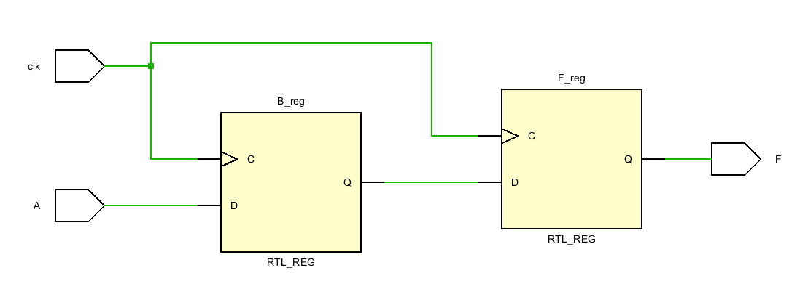

### synthesis

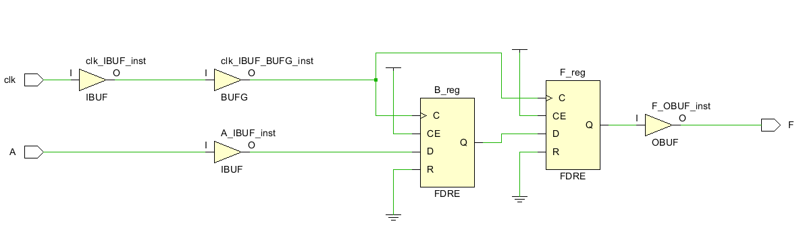

### sim

(1) 5ns 结束时, a = 0; b = 0(b <= a); f = x(f <= b)

(2) 15ns 结束时, a = 1; b = 1(b <= a); f = 0(f <= b)

(2) 25ns 结束时, a = 0; b = 0(b <= a); f = 1(f <= b)

## 整体分析

非阻塞性赋值，在传递过程中，有一种滞后的效果。
