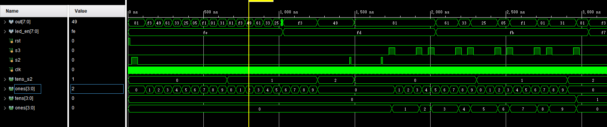
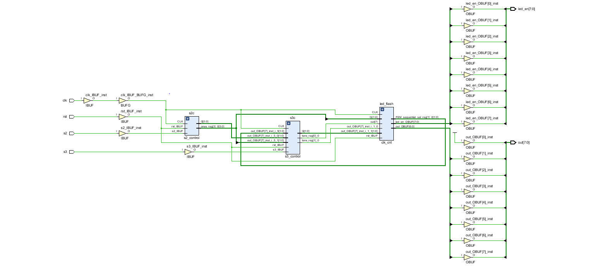
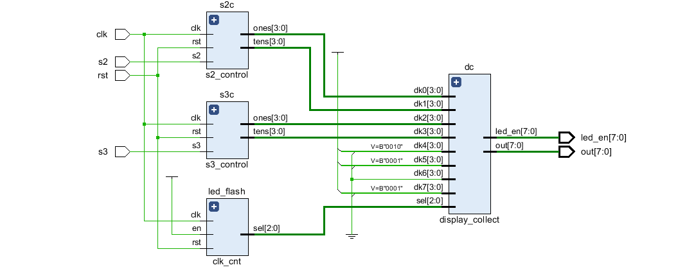
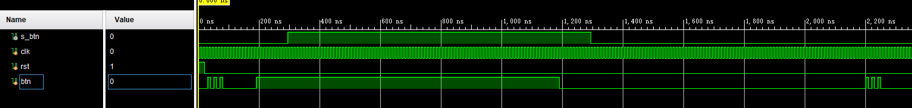
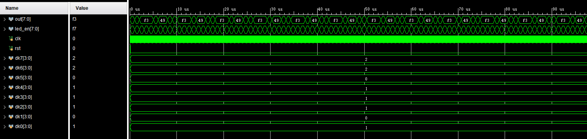

# lab4

### sim

(1) 15ns 时，rst=0，复位结束

(2) 25 ~ 35ns 时，s2=1，dk0，dk1 开始计数

(3) 1255ns 时，{s2_tens, s2_ones} = 20，计数结束，保持

(4) 1465ns ~ 1475 时，s2 按下，s2_tens = 0，s2_ones = 0

(5) 1675ns ~ 1685 时，s2 按下，dk0，dk1 开始计数

(6) 1725 时，s3 按下，{dk3, dk2} 开始计数，{dk3, dk2} = 1

(7) 1905 时，s3 按下，{dk3, dk2} = 2

(8) 1985 时，s3 按下，{dk3, dk2} = 3

(9) 2165 时，s3 按下，{dk3, dk2} = 4

(10) 2245 时，s3 按下，{dk3, dk2} = 5

(11) 2245 时，s3 按下，{dk3, dk2} = 5

(12) 2425 时，s3 按下，{dk3, dk2} = 6

(13) 2505 时，s3 按下，{dk3, dk2} = 7

(13) 2685 时，s3 按下，{dk3, dk2} = 8

(13) 2765 时，s3 按下，{dk3, dk2} = 9

(13) 2945 时，s3 按下，{dk3, dk2} = 10

### syn

### rtl

### 消抖 sim

(1) 20ns 时，rst 弹起

(2) 30ns ~ 80ns 时，btn 抖动

(3) 190ns ~ 1190ns 时，btn 持续按下，s_btn 输出在 295ns ~ 1295ns 时为 1295ns ~ 1295ns 时为 1

### 轮询

