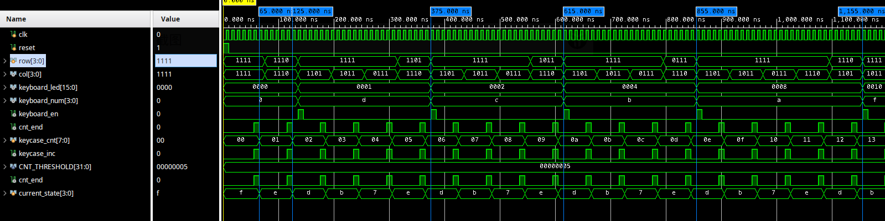
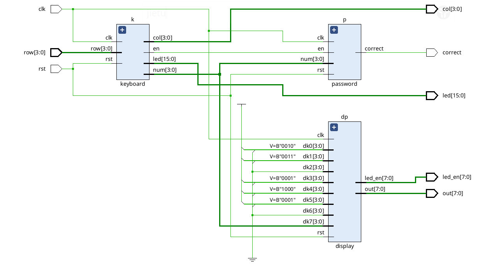
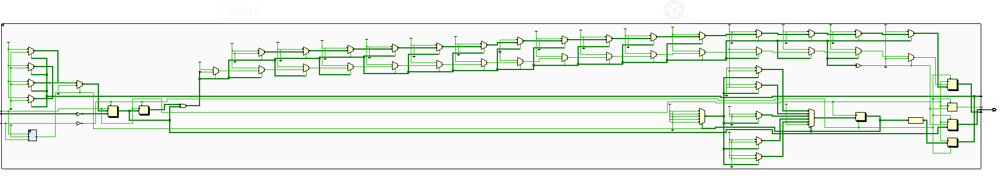
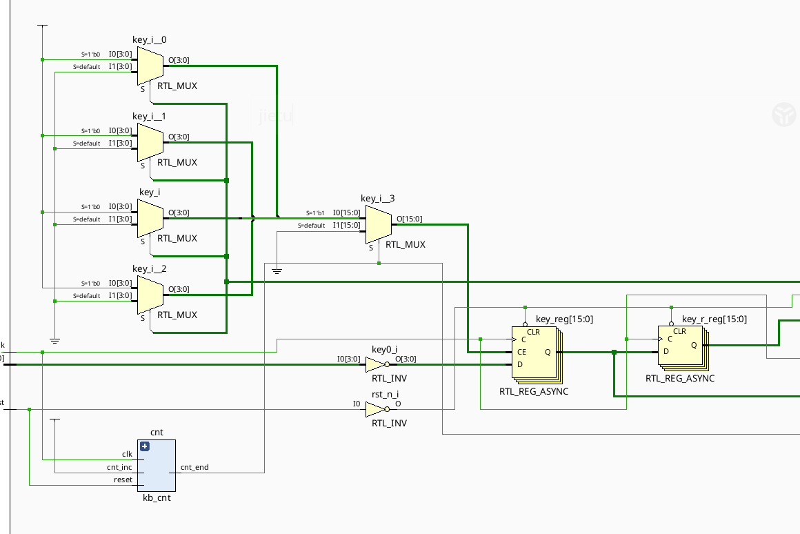
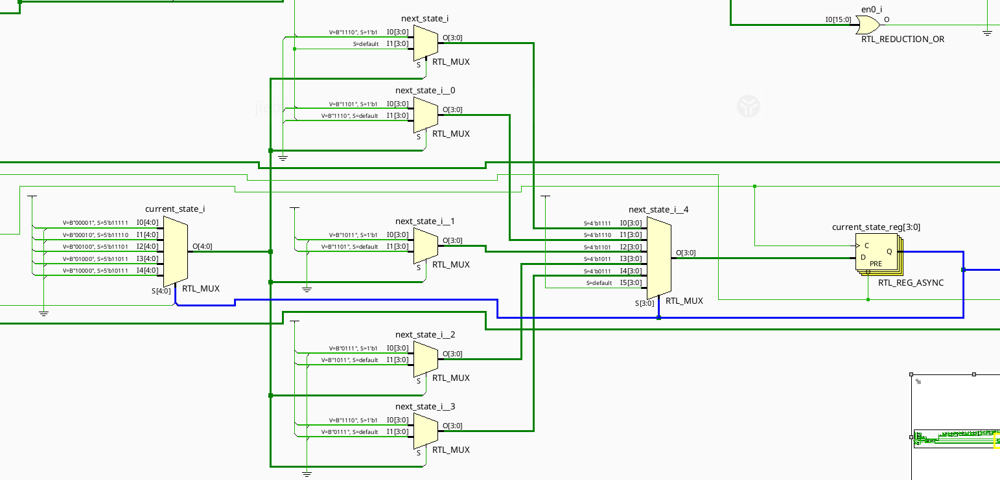
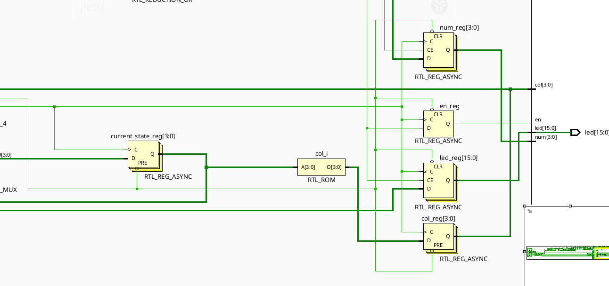
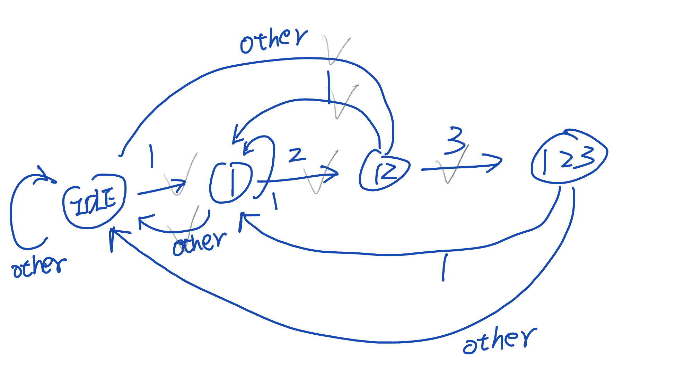
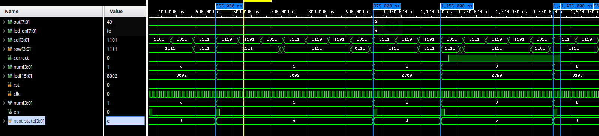

# 实验 5

## 状态机 sim



(1) 65ns， cnt_end=1，状态 f -> e， 经过一个周期， col = 1110, row = 1110（按下）， 直到松开， 有 keyboard_num = d

(2) 365ns， cnt_end=1， 状态 e -> d， 经过一个周期， col = 1110, row = 1101（按下）, 直到松开， 有 keyboard_num = c

(3) 555ns， cnt_end=1， 状态 e -> d， 经过一个周期， col = 1110, row = 1101（按下）, 直到松开， 有 keyboard_num = b

(4) 605ns， cnt_end=1， 状态 e -> d， 经过一个周期， col = 1110, row = 1011（按下）, 直到松开， 有 keyboard_num = a

(5) 1145ns， cnt_end=1， 状态 e -> d， 经过一个周期， col = 1101, row = 1101（按下）, 直到松开， 有 keyboard_num = f(`#`)

(6) 1325ns， cnt_end=1， 状态 e -> d， 经过一个周期， col = 1101, row = 1101（按下）, 直到松开， 有 keyboard_num = 9

(6) 1565ns， cnt_end=1， 状态 e -> d， 经过一个周期（10ns）， col = 1101, row = 1011（按下）, 直到松开（1635ns）， 有 keyboard_num = 6

## 状态定义与状态转移条件

```verilog
parameter IDLE = 4'b1111;
parameter S0 = 4'b1110;
parameter S1 = 4'b1101;
parameter S2 = 4'b1011;
parameter S3 = 4'b0111;

// 这些是条件， 但是其实条件是差不多的， 都是 cnt_end
wire idle_s0_con = current_state == IDLE && cnt_end;
wire s0_s1_con = current_state == S0 && cnt_end;
wire s1_s2_con = current_state == S1 && cnt_end;
wire s2_s3_con = current_state == S2 && cnt_end;
wire s3_s0_con = current_state == S3 && cnt_end;
```

cnt_end 表示： 计数器 计算到头的时候。

## 状态转移图

状态转移图 # TODO


## RTL 分析



keyboard 是用来 检测按下了什么 键

password 是用来 检测密码是否输入正确的，里面也是一个状态机

display 是用来 显示的，其中 keyboard 的输出 num，只连接了 display 的 dk7

### keyboard





左边这一块是用来：给 寄存器堆 的相应的 row 赋值



这段就对应的是状态机

current_state_reg 是存储状态的

current_state_reg 左边是：状态转移的



这里 靠右边的部分就是：输出逻辑

## 附加题（密码锁）

### 设计说明

正确的密码是： "123"

如果输入正确，K17 也就是最左边的 led 会亮（也就是 correct 变量为 1）

### 状态转移图



### 仿真分析



(1) 555ns 时， col = 0111 时，row = 0111 弹起， 状态：f -> e

(2) 975ns 时， col = 1011 时，row = 0111 弹起， 状态：e -> d

(3) 1155ns 时， col = 1101 时， row = 0111 弹起， 状态： d -> b

(4) 1175ns 时， 由输出逻辑，correct 根据状态 correct = 1

(5) 1455ns 时， col = 1011 时， row = 1101 弹起， 状态： b -> f

(6) 1635ns 时， col = 1011 时， correct = 0
