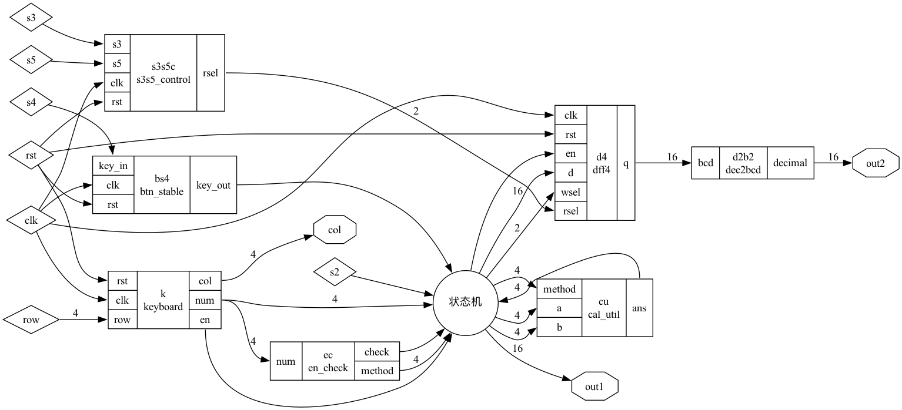
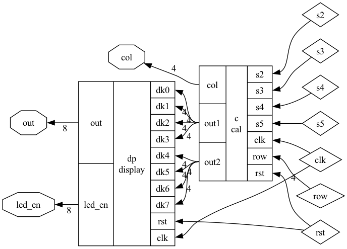
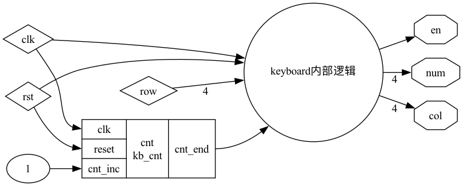
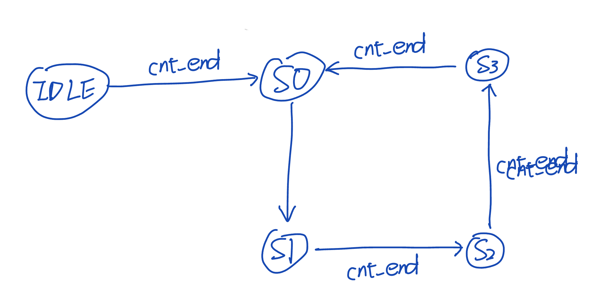
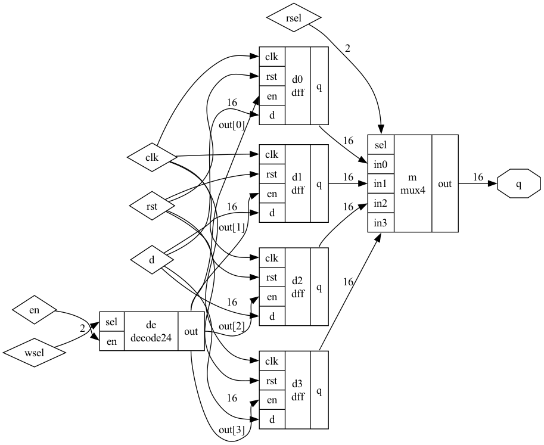
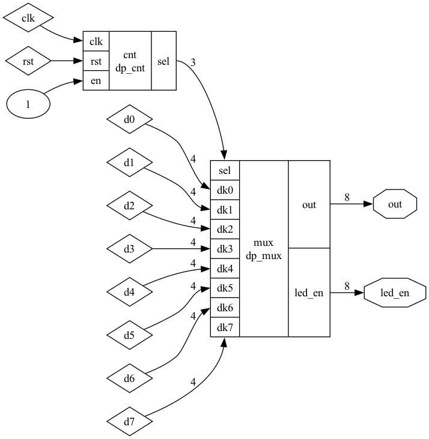
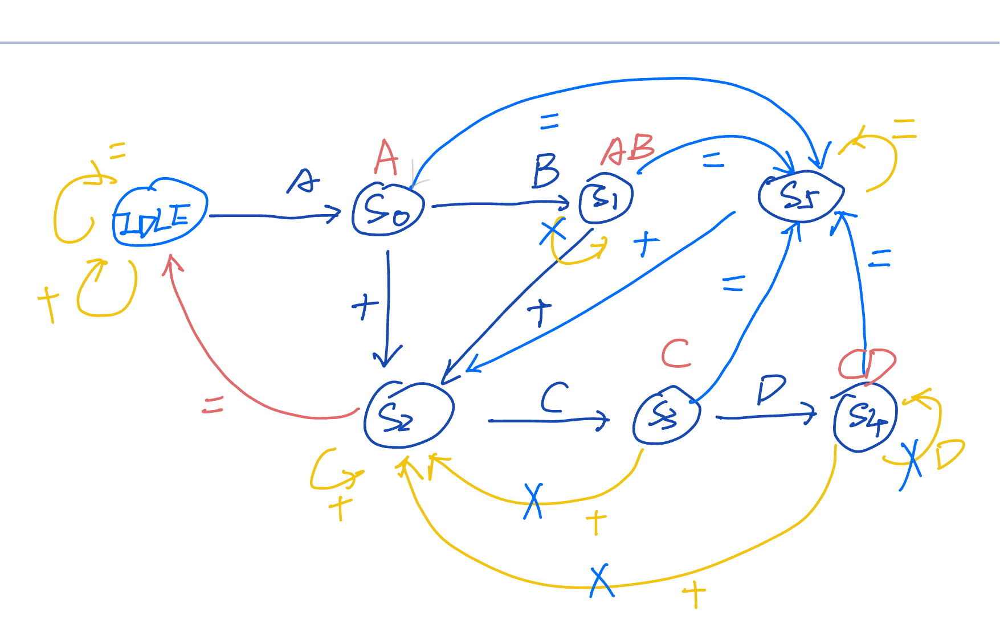
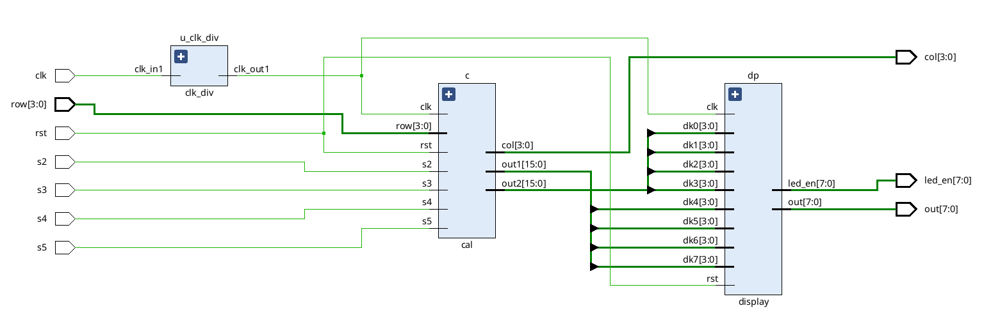

# 实验报告

我这里是将辅助模块 与 文件的主模块 放到了一起。毕竟其他地方也没有复用（。

文件的主模块就是 以文件名命名 的模块

## 设计的功能描述

- 按键开关 S1 作为异步复位信号，且当 S1 按下时，系统被复位等待数据输入；
- 按键开关 S2 作为每次计算启动信号（类似计算器的“等于号”功能）；
- 操作数由 4\*4 矩阵键盘输入；
- 输入数据范围为 2 位十进制正整数；
- 运算操作由 ABCD 代替，分别代表加、减、乘、除；
- 连续运算功能举例：先输入 1+2，按下 S2 算出结果为 3，再输入+3，跟上一步算出的结果直接计算，得到结果是 6；
- 计算结果输出到数码管上，输出要求 4 个数码管显示，能显示 2 位十进制乘以 2 位十进制的结果。
- 在数码管实时显示输入的数据和运算符，比如计算 5\*20，左边 4 个数码管显示 5C20，不显示等号，输入数据超出 4 个字符的只显示最近的 4 个输入。
- 存储最近的 4 次计算结果，计算完成后，按下 S4 存储当前的计算结果，通过 S3 上翻显示上一个结果，S5 下翻显示下一个结果，只保存结果，无保存过程。

## 系统功能详细设计

### cal

依赖关系如下：

- cal
  - btn_stable
  - en_check
  - cal_util
  - dec2bcd
  - keyboard
  - dff4
  - s3s5_control
    - btn_stable

这个文件就是用来控制 计算器的，有手动保存功能，也有显示功能

首先我们来分析一下需求，以为我们的屏幕，输出只有 4 个 10 进制位，保存也是只有 4 个十进制位。
因此，我认为，我们四则运算的两个变量，a 和 b，应该是 2 为，毕竟 99 \* 99 也不过是 9801 这 4 个十进制位。
我的想法是：如果出现了连续计算，那么我们只将结果，截去后 2 位进行计算，毕竟都溢出了（

然后我们将这个 keyboard 放到了这个 cal 中，因为我们需要用到这个 keyboard 的许多信息，放进来应该是合适的，
当然也可以 keyboard 与 cal 一起放在 top_module 中，但是我们这里选择了前者。



输入：clk，rst，s2，s3，s4，s5，row；输出：out1，out2，col；s2 是 “等号”；s3 是 “向上翻页”；s5 是 “向下翻页”；s4 是将计算结果保存到 寄存器堆 中；col 是键盘的 扫描输出信号；row 是按下的第 row 行的 one-hot 码；out1 是 计算序列；out2 是 寄存器的输出序列

这样设计的原因：将一些模块写入到了一个文件里面，因为这些模块有些并没有复用的价值

### top_module

- top_module
  - clk_div
  - cal
  - display



输入：s2，s3，s4，s5，clk，row，rst；输出：col，out，led_en

s2 是 “等号”；s3 是 “向上翻页”；s5 是 “向下翻页”；s4 是将计算结果保存到 寄存器堆 中；col 是键盘的 扫描输出信号；row 是按下的第 row 行的 one-hot 码；led_en 是 分时复用 扫描到第 i 个数位管，out 是第 i 位的数位管显示的值。

这样设计的原因：模块可以复用，并且 高内聚，低耦合

## 模块设计与实现

### keyboard.v 文件

依赖关系如下：

- keyboard
  - kb_cnt

这个文件是用来检测：键盘按下了哪个键，会在 cal.v 中使用到



输入：clk，rst，row；输出：en，num，col； row 是按下的信号；col 是列扫描信号；num 是输出按下的数；en 是判断键盘是否按下

#### kb_cnt

kb_cnt 是用来控制状态是否跳转的， 或者是 kb_cnt 生成的 cnt_end 这个信号就是通用的 状态转移 的条件。这个就是一个最简单的计数器，代码如下：

```verilog
module kb_cnt #(
    parameter END   = 15,
    parameter WIDTH = 4
) (
    input clk,
    input reset,
    input cnt_inc,
    output cnt_end,
    output reg [WIDTH-1:0] cnt
);

  assign cnt_end = (cnt == END);

  always @(posedge clk, posedge reset) begin
    if (reset) cnt <= 0;
    else if (cnt_end) cnt <= 0;
    else if (cnt_inc) cnt <= cnt + 1;
  end

endmodule
```

#### keyboard

keyboard 的状态转移图如下：



有 5 个状态：空闲状态 IDLE，S0，S1，S2，S3。除 IDLE 外，其他状态对应的有列扫描信号

IDLE 使用 1111 编码，其他使用 one-hot 形式的编码。

三段式状态机：

1. 状态转移表：

```verilog
// 状态转移的条件
wire idle_s0_con = current_state == IDLE && cnt_end;
wire s0_s1_con = current_state == S0 && cnt_end;
wire s1_s2_con = current_state == S1 && cnt_end;
wire s2_s3_con = current_state == S2 && cnt_end;
wire s3_s0_con = current_state == S3 && cnt_end;

// state migrate table
always @(*) begin
  case (current_state)
    IDLE: begin
      if (idle_s0_con) begin
        next_state = S0;
      end else begin
        next_state = IDLE;
      end
    end
    S0: begin
      if (s0_s1_con) begin
        next_state = S1;
      end else begin
        next_state = S0;
      end
    end
    S1: begin
      if (s1_s2_con) begin
        next_state = S2;
      end else begin
        next_state = S1;
      end
    end
    S2: begin
      if (s2_s3_con) begin
        next_state = S3;
      end else begin
        next_state = S2;
      end
    end
    S3: begin
      if (s3_s0_con) begin
        next_state = S0;
      end else begin
        next_state = S3;
      end
    end
    default: next_state = IDLE;
  endcase
end
```

2. 状态迁移

```verilog
// migrate current to next
always @(posedge clk or negedge rst_n) begin
  if (rst_n == 1'b0) begin
    current_state <= IDLE;
  end else begin
    current_state <= next_state;
  end
end
```

3. 输出方程（生成列扫描信号）

```verilog
// output
always @(posedge clk or negedge rst_n) begin
  if (rst_n == 1'b0) col <= 4'b1111;
  else begin
    case (current_state)
      S0: col <= 4'b1110;
      S1: col <= 4'b1101;
      S2: col <= 4'b1011;
      S3: col <= 4'b0111;
      IDLE: col <= 4'b1111;
      default: col <= 4'b1111;
    endcase
  end
end
```

4. 根据 row 按下的信息，以及 col 扫描的信息，可以知道按下了哪个按键

```verilog
reg [15:0] key;
reg [15:0] key_r;

always @(posedge clk or negedge rst_n) begin
  if (rst_n == 1'b0) key <= 16'h0000;
  else if (cnt_end) begin  // 这里要注意（同步） // TODO 遇到的困难
    if (col[0] == 0) begin
      key[3:0] <= ~row;
    end
    if (col[1] == 0) begin
      key[7:4] <= ~row;
    end
    if (col[2] == 0) begin
      key[11:8] <= ~row;
    end
    if (col[3] == 0) begin
      key[15:12] <= ~row;
    end
  end
end

always @(posedge clk or negedge rst_n) begin
  if (rst_n == 1'b0) begin
    key_r <= 0;
  end else begin
    key_r <= key;
  end
end

wire [15:0] key_posedge = (~key_r) & key;

/* decode and led en*/

/* check press */
// if press en
always @(posedge clk or negedge rst_n) begin
  if (rst_n == 1'b0) begin
    en <= 1'b0;
  end else begin
    if (key_posedge) begin
      en <= 1'b1;
    end else begin
      en <= 1'b0;
    end
  end
end


/* decode num */
always @(posedge clk or negedge rst_n) begin
  if (rst_n == 1'b0) begin
    num <= 4'h0;
  end else if (key_posedge) begin
    if (key_posedge[0]) num <= 4'hd;
    else if (key_posedge[1]) num <= 4'hc;
    else if (key_posedge[2]) num <= 4'hb;
    else if (key_posedge[3]) num <= 4'ha;
    else if (key_posedge[4]) num <= 4'hf;
    else if (key_posedge[5]) num <= 4'h9;
    else if (key_posedge[6]) num <= 4'h6;
    else if (key_posedge[7]) num <= 4'h3;
    else if (key_posedge[8]) num <= 4'h0;
    else if (key_posedge[9]) num <= 4'h8;
    else if (key_posedge[10]) num <= 4'h5;
    else if (key_posedge[11]) num <= 4'h2;
    else if (key_posedge[12]) num <= 4'he;
    else if (key_posedge[13]) num <= 4'h7;
    else if (key_posedge[14]) num <= 4'h4;
    else if (key_posedge[15]) num <= 4'h1;
  end else begin
    num <= num;
  end
end
```

### dff4.v

模块间的依赖关系如下：

- dff4
  - dff
  - mux4
  - decode24

这个文件主要是描述了寄存器堆，这会在 cal.v 中使用到，（附加题：保存结果）



输入：en，wsel，rsel，clk，rst，d；输出：q。en 表示：是否写入；wsel 是写入哪个编号的寄存器；rsel 表示读取哪个编号的寄存器；d 是写入到 wsel 对应的寄存器的值；q 是读取到 rsel 对应的寄存器的值

#### dff

dff 就是单个 16 位的寄存器

en 是写使能端，en=1，那么将 d 保存到 q 中

```verilog
module dff (
    output reg [15:0] q,
    input clk,
    input rst,
    input en,  // 是否写入
    input wire [15:0] d
);

  wire rst_n = ~rst;
  always @(negedge rst_n or posedge clk) begin
    if (~rst_n) begin
      q <= 0;
    end else begin
      if (en) begin
        q <= d;
      end else begin
        q <= q;
      end
    end
  end

endmodule
```

#### mux4

4 选 1 的多路选择器，顾名思义

从 4 个中选择一个进行输出

```verilog
// 多路选择器
module mux4 (
    output reg  [15:0] out,
    input  wire [ 1:0] sel,
    input  wire [15:0] in0,
    input  wire [15:0] in1,
    input  wire [15:0] in2,
    input  wire [15:0] in3
);
  always @(*) begin
    case (sel)
      2'b00:   out = in0;
      2'b01:   out = in1;
      2'b10:   out = in2;
      2'b11:   out = in3;
      default: out = 0;
    endcase
  end
endmodule
```

#### decode24

24 译码器，顾名思义

en 是 写使能

```verilog
module decode24 (
    output reg [3:0] out,
    input wire [1:0] sel,
    input wire en
);
  always @(*) begin
    if (en) begin
      case (sel)
        2'b00: out = 4'b0001;
        2'b01: out = 4'b0010;
        2'b10: out = 4'b0100;
        2'b11: out = 4'b1000;
      endcase
    end else begin
      out = 4'b0000;
    end
  end
endmodule
```

#### dff4

实例化了 4 个 16 位的 dff。
d 是将要写入的信息，wsel 是选择写入第一个寄存器（由 decode24 控制）。
rsel 是选择读取第几个寄存器（由 mux4 控制）。
en 就是：写使能，en = 0 的话，那么 decode 出来的 wsel_de = 0，否则根据 wsel，
只有一位有效，也就是对应的寄存器，只有一个被写使能。

```verilog
module dff4 (
    output wire [15:0] q,
    input wire clk,
    input wire rst,
    input wire en,  // 写入开关
    input wire [15:0] d,
    input wire [1:0] wsel,
    input wire [1:0] rsel
);
  wire [3:0] wsel_de;  // 只有一个是有用的
  wire [15:0] r0, r1, r2, r3;

  // 4选1,选择写入
  decode24 de (
      .out(wsel_de),
      .sel(wsel),
      .en (en)
  );

  dff d0 (
      .q  (r0),
      .clk(clk),
      .rst(rst),
      .en (wsel_de[0]),
      .d  (d)
  );
  dff d1 (
      .q  (r1),
      .clk(clk),
      .rst(rst),
      .en (wsel_de[1]),
      .d  (d)
  );
  dff d2 (
      .q  (r2),
      .clk(clk),
      .rst(rst),
      .en (wsel_de[2]),
      .d  (d)
  );
  dff d3 (
      .q  (r3),
      .clk(clk),
      .rst(rst),
      .en (wsel_de[3]),
      .d  (d)
  );
  mux4 m (
      .out(q),
      .sel(rsel),
      .in0(r0),
      .in1(r1),
      .in2(r2),
      .in3(r3)
  );
endmodule
```

### display.v

依赖关系如下：

- display
  - dp_cnt
  - dp_mux

这个文件是用来控制 数位管的 显示的，并且这是一个 分时复用 的元件



输入：clk，rst，d0，d1，d2，d3，d4，d5，d6，d7；输出：out，led_en。dx 表示要显示的第 x 位的数值；out 表示：扫描到的第 i 位的输出的值；led_en 表示：第 i 位的 one-hot 码

#### dp_mux

这个模块是纯 组合逻辑

dk7 ... dk0 表示这 8 个数位管，所要显示的 16 进制的数，这个数是 4 位的位宽

sel 表示：计数器的输出，然后接到了 dp_mux 的输入

led_en 表示：sel 译码后，只有一个使能的输出信号

out 表示：dkx，进行对应的数码管的编码

前半段是一个 选择器，dki 中选择一个数值，然后我将第 i 个数码管使能

后半段是对：dki 进行编码，能让他在数码管上显示

```verilog
module dp_mux (
    output reg  [7:0] out,     // 数字显示输出
    output reg  [7:0] led_en,  // LED 使能信号
    input  wire [2:0] sel,     // 选择输入
    input  wire [3:0] dk7,
    dk6,
    dk5,
    dk4,
    dk3,
    dk2,
    dk1,
    dk0  // 输入信号
);

  // mux
  reg [3:0] mid;

  // mux logic
  always @(*) begin
    case (sel)
      3'b000: begin
        mid = dk0;
        led_en = 8'b11111110;
      end
      3'b001: begin
        mid = dk1;
        led_en = 8'b11111101;
      end
      3'b010: begin
        mid = dk2;
        led_en = 8'b11111011;
      end
      3'b011: begin
        mid = dk3;
        led_en = 8'b11110111;
      end
      3'b100: begin
        mid = dk4;
        led_en = 8'b11101111;
      end
      3'b101: begin
        mid = dk5;
        led_en = 8'b11011111;
      end
      3'b110: begin
        mid = dk6;
        led_en = 8'b10111111;
      end
      3'b111: begin
        mid = dk7;
        led_en = 8'b01111111;
      end
    endcase
  end

  // decode logic
  always @(*) begin
    case (mid)
      4'h0: out = 8'b10000001;
      4'h1: out = 8'b11110011;
      4'h2: out = 8'b01001001;
      4'h3: out = 8'b01100001;
      4'h4: out = 8'b00110011;
      4'h5: out = 8'b00100101;
      4'h6: out = 8'b00000101;
      4'h7: out = 8'b11110001;
      4'h8: out = 8'b00000001;
      4'h9: out = 8'b00110001;
      4'ha: out = 8'b00010001;
      4'hb: out = 8'b00000111;
      4'hc: out = 8'b01001111;
      4'hd: out = 8'b01000011;
      default: out = 8'b11111111;
    endcase
  end

endmodule
```

#### dp_cnt

这里是用 计数器 产生一个选择信号 sel

下面就是经典的计数器的结构了，cnt_inc 表示：是否要自增；
cnt_end 表示：计数到了 F 了；
cnt 表示：如果到了 F(cnt_end)，那么就清零，如果要自增(cnt_inc)，那么就自增
sel：每当 cnt_end 出现一次脉冲，那么 sel 就发生自增，这个自增是循环的

```verilog
// this is select led
module dp_cnt #(
    parameter F = 10000
)  // log2(1500000) = 20.51
(
    output reg [2:0] sel,
    input clk,
    input rst,
    input en  // en default to 1
);
  reg [20:0] cnt;
  reg cnt_inc;
  wire rst_n = ~rst;
  wire cnt_end = cnt_inc & (cnt == F);

  // clk enable count
  always @(posedge clk or negedge rst_n) begin
    if (~rst_n) begin
      cnt_inc <= 1'b0;
    end else if (en) begin
      cnt_inc <= 1'b1;
    end else if (cnt_end) begin
      cnt_inc <= 1'b0;
    end
  end

  // clk count increase
  always @(posedge clk or negedge rst_n) begin
    if (~rst_n) begin
      cnt <= 21'h0;
    end else if (cnt_end) begin
      cnt <= 21'h0;
    end else if (cnt_inc) begin
      cnt <= cnt + 21'h1;
    end
  end

  // digital select，这里实际上就是加法
  always @(posedge clk or negedge rst_n) begin
    if (~rst_n) begin
      sel <= 3'b000;
    end  // else if (sel == 3'b111) begin sel <= 3'b000; end
         // else if (cnt_end) begin sel <= sel + 3'b001; end
    else if (cnt_end) begin
      case (sel)
        3'b000: sel <= 3'b001;
        3'b001: sel <= 3'b010;
        3'b010: sel <= 3'b011;
        3'b011: sel <= 3'b100;

        3'b100: sel <= 3'b101;
        3'b101: sel <= 3'b110;
        3'b110: sel <= 3'b111;
        3'b111: sel <= 3'b000;
      endcase
    end
  end
endmodule
```

#### display

输入 dk7...dk0（16 进制），输出 led_en（当前使能的数位管），以及数位管上应该显示什么（out）

将 dp_cnt 与 dp_mux 连接起来即可

```verilog
module display #(
    parameter F = 10000
) (
    output reg [7:0] out,
    output reg [7:0] led_en,
    input [3:0] dk7,
    dk6,
    dk5,
    dk4,
    dk3,
    dk2,
    dk1,
    dk0,
    input clk,
    input rst
);

  wire [2:0] sel;
  dp_cnt cnt (
      .sel(sel),
      .clk(clk),
      .rst(rst),
      .en (1'b1)
  );
  defparam cnt.F = F;

  wire [7:0] mid_out, mid_en;
  dp_mux mux (
      .out(mid_out),
      .led_en(mid_en),
      .sel(sel),
      .dk7(dk7),
      .dk6(dk6),
      .dk5(dk5),
      .dk4(dk4),
      .dk3(dk3),
      .dk2(dk2),
      .dk1(dk1),
      .dk0(dk0)
  );

  always @(*) begin
    out = mid_out;
    led_en = mid_en;
  end
endmodule
```

### top_module.v

依赖关系如下：

- top_module
  - clk_div
  - cal
  - display


输入：s2，s3，s4，s5，clk，row，rst；输出：col，out，led_en

s2 是 “等号”；s3 是 “向上翻页”；s5 是 “向下翻页”；s4 是将计算结果保存到 寄存器堆 中；col 是键盘的 扫描输出信号；row 是按下的第 row 行的 one-hot 码；led_en 是 分时复用 扫描到第 i 个数位管，out 是第 i 位的数位管显示的值。

### cal.v

依赖关系如下：

- cal
  - btn_stable
  - en_check
  - cal_util
  - dec2bcd
  - keyboard
  - dff4
  - s3s5_control
    - btn_stable

这个文件就是用来控制 计算器的，有手动保存功能，也有显示功能

首先我们来分析一下需求，以为我们的屏幕，输出只有 4 个 10 进制位，保存也是只有 4 个十进制位。
因此，我认为，我们四则运算的两个变量，a 和 b，应该是 2 为，毕竟 99 \* 99 也不过是 9801 这 4 个十进制位。
我的想法是：如果出现了连续计算，那么我们只将结果，截去后 2 位进行计算，毕竟都溢出了（

然后我们将这个 keyboard 放到了这个 cal 中，因为我们需要用到这个 keyboard 的许多信息，放进来应该是合适的，
当然也可以 keyboard 与 cal 一起放在 top_module 中，但是我们这里选择了前者。


输入：clk，rst，s2，s3，s4，s5，row；输出：out1，out2，col；s2 是 “等号”；s3 是 “向上翻页”；s5 是 “向下翻页”；s4 是将计算结果保存到 寄存器堆 中；col 是键盘的 扫描输出信号；row 是按下的第 row 行的 one-hot 码；out1 是 计算序列；out2 是 寄存器的输出序列

#### btn_stable

这个能够维持稳定的原理：如果按下按键，对这段时间进行计数，
如果 cnt 达到了某个值，也就是这里的 15000 - 1，对应的是 0.15 ms，
这样就可以过滤掉一些机械抖动，按键按下，也仅会有一个上升沿，不出现很多个的现象。

```verilog
module btn_stable #(
    parameter F = 15000 - 1
) (
    output reg key_out,
    input key_in,
    input clk,
    input rst
);
  wire rst_n = ~rst;
  reg [19:0] cnt;
  reg key_cnt;

  // collect the result
  always @(posedge clk or negedge rst_n) begin
    if (rst_n == 1'b0) key_out <= 1'b0;
    else if (cnt == F - 1) key_out <= key_in;
  end

  // inc cnt
  always @(posedge clk or negedge rst_n) begin
    if (rst_n == 1'b0) cnt <= 20'h0;
    else if (key_cnt) cnt <= cnt + 20'h1;
    else cnt <= 20'h0;
  end

  always @(posedge clk or negedge rst_n) begin
    if (rst_n == 1'b0) key_cnt <= 0;
    else if (key_cnt == 1'b0 && key_in != key_out) key_cnt <= 1'b1;
    else if (cnt == F - 1) key_cnt <= 1'b0;
  end

endmodule
```

#### en_check

这个模块是用来检测，按下的是不是 a, b, c, d，
如果是，输出 check=1，并输出对应的 one-hot 码

```verilog
// 是否按下 operator
module en_check (
    output reg check,
    output reg [3:0] method,
    input [3:0] num
);

  // 用来判断+-*/的
  always @(*) begin
    case (num)
      4'ha: begin  // +
        check  = 1'b1;
        method = 4'b1110;
      end
      4'hb: begin  // -
        check  = 1'b1;
        method = 4'b1101;
      end
      4'hc: begin  // *
        check  = 1'b1;
        method = 4'b1011;
      end
      4'hd: begin  // /
        check  = 1'b1;
        method = 4'b0111;
      end

      default: begin
        check  = 1'b0;
        method = 4'b1111;
      end
    endcase
  end

endmodule
```

#### cal_util

这个是一个组合逻辑电路，就是用来计算的

ans 是计算返回值，method 是计算的方法（+-\*/)，
a，b 就是计算的数

```verilog
module cal_util (
    output reg [15:0] ans,
    input [3:0] method,
    input [7:0] a,
    input [7:0] b
);

  // 计算
  always @(*) begin
    case (method)
      4'b1110: begin
        ans = a + b;
      end
      4'b1101: begin
        ans = a - b;
      end
      4'b1011: begin
        ans = a * b;
      end
      4'b0111: begin
        ans = a / b;
      end
      default: begin
        ans = 0;
      end
    endcase
  end

endmodule
```

#### dec2bcd

这个模块是用来 将 二进制 转化为 bcd 的。
实际上，我们的这个 a，b，都是 2 个 16 进制位，
因为要利用 verilog 中的 + - \* / 也只能这样。

我们在输出显示的时候，就将 a，b 转化为 bcd。

事实上，我们只是将 寄存器堆中的 数值 转化为 bcd。

```verilog
// 这是将 十进制 转化为 bcd码
module dec2bcd (
    output reg  [15:0] bcd,
    input  wire [15:0] decimal
);

  // 转化为bcd码
  always @(*) begin
    bcd[15:12] = (decimal / 1000) % 10;  // 千
    bcd[11:8]  = (decimal / 100) % 10;  // 百
    bcd[7:4]   = (decimal / 10) % 10;  // 十
    bcd[3:0]   = decimal % 10;  // 个
  end

endmodule
```

#### s3s5_control

这里是用来控制 寄存器堆 的读取。
rsel 表示，读取第 rsel 个寄存器。
这里我们就会用到这个 按键消抖 + 边缘检测

在按键消抖的情况下，如果 s3 出现了上升边缘 s3_pos，那么`rsel--`；
同理，出现了 s5_pos，那么`rsel++`。这样就可以选择不同的 寄存器 ，并显示里面存放的数值

```verilog
module s3s5_control #(
    parameter F = 15000 - 1
) (
    output reg [1:0] rsel,
    input wire s3,
    input wire s5,
    input wire clk,
    input wire rst
);

  wire rst_n = ~rst;

  /* 检测s3按下，上升沿 */

  reg s3_sig_r0, s3_sig_r1;

  wire s3_eco;

  btn_stable bs3 (
      .key_out(s3_eco),
      .key_in(s3),
      .clk(clk),
      .rst(rst)
  );
  defparam bs3.F = F;

  always @(posedge clk or negedge rst_n) begin
    if (~rst_n) begin
      s3_sig_r0 <= 1'b0;
    end else begin
      s3_sig_r0 <= s3_eco;  // signal
    end
  end

  always @(posedge clk) begin
    if (rst) begin
      s3_sig_r1 <= 1'b0;
    end else begin
      s3_sig_r1 <= s3_sig_r0;
    end
  end

  wire s3_pos = ~s3_sig_r1 & s3_sig_r0;

  /* 检测s5按下，上升沿 */

  reg s5_sig_r0, s5_sig_r1;

  wire s5_eco;

  btn_stable bs5 (
      .key_out(s5_eco),
      .key_in(s5),
      .clk(clk),
      .rst(rst)
  );
  defparam bs5.F = F;

  always @(posedge clk or negedge rst_n) begin
    if (~rst_n) begin
      s5_sig_r0 <= 1'b0;
    end else begin
      s5_sig_r0 <= s5_eco;
    end
  end

  always @(posedge clk) begin
    if (rst) begin
      s5_sig_r1 <= 1'b0;
    end else begin
      s5_sig_r1 <= s5_sig_r0;
    end
  end

  wire s5_pos = ~s5_sig_r1 & s5_sig_r0;

  /* 寄存器堆输出 */

  always @(posedge clk or negedge rst_n) begin
    if (~rst_n) begin
      rsel <= 0;
    end else begin
      case ({
        s3_pos, s5_pos
      })
        2'b00: begin
          rsel <= rsel;
        end
        2'b11: begin
          rsel <= rsel;
        end
        2'b01: begin  // 下翻页，++
          if (rsel == 2'b11) rsel <= 2'b00;
          else rsel <= rsel + 1;
        end
        2'b10: begin  // 上翻页，--
          if (rsel == 2'b00) rsel <= 2'b11;
          else rsel <= rsel - 1;
        end
        default: begin
          rsel <= rsel;
        end
      endcase
    end
  end
endmodule
```

#### cal

状态转移图



状态编码：

IDLE 是空闲状态 111111；
S0 是 111110；S1 是 111101；S2 是 111011；S3 是 110111；S4 是 101111；S5 是 011111

1. 状态迁移

```verilog
always @(posedge clk or negedge rst_n) begin
    if (~rst_n) current_state <= IDLE;
    else begin
        current_state <= next_state;
    end
end
```

2. 状态转移表

```verilog
always @(*) begin
    case (current_state)

        IDLE: begin
        if (s2) begin
            next_state <= IDLE;
        end else if (check) begin
            next_state <= IDLE;
        end else if (en) begin
            next_state <= S0;
        end else begin
            next_state <= IDLE;
        end
        end

        S0: begin
        if (s2) begin
            next_state <= S5;
        end else if (check) begin
            next_state <= S2;
        end else if (en) begin
            next_state <= S1;
        end else begin
            next_state <= S0;
        end
        end

        S1: begin
        if (s2) begin
            next_state <= S5;
        end else if (check) begin
            next_state <= S2;
        end else if (en) begin
            // 防御
        end else begin
            next_state <= S1;
        end
        end

        S2: begin
        if (s2) begin
            next_state <= IDLE;
            // 防御
        end else if (check) begin
            // 防御
        end else if (en) begin
            next_state <= S3;
        end else begin
            next_state <= S2;
        end
        end

        S3: begin
        if (s2) begin
            next_state <= S5;
        end else if (check) begin
            // 连加，防御
        end else if (en) begin
            next_state <= S4;
        end else begin
            next_state <= S3;
        end
        end

        S4: begin
        if (s2) begin
            next_state <= S5;
        end else if (check) begin
            // 连加，防御
        end else if (en) begin
            // 移位，防御
        end else begin
            next_state <= S4;
        end
        end

        S5: begin
        if (s2) begin
            // 防御
        end else if (check) begin
            next_state <= S2;
        end else if (en) begin
            next_state <= S0;
        end else begin
            next_state <= S5;
        end
        end
    endcase
    end
```

3.1 状态机输出 a，b

```verilog
always @(posedge clk or negedge rst_n) begin
    if (~rst_n) begin
        a <= 0;
        b <= 0;
        method <= 4'b1111;
        is_method <= 0;
    end else begin
        case (current_state)
            IDLE: begin
                if (s2) begin
                    // next_state <= IDLE;
                    a <= 0;
                    b <= 0;
                    method <= 4'b1111;
                    is_method <= 0;
                end else if (check) begin
                    // next_state <= IDLE;
                    a <= 0;
                    b <= 0;
                    method <= 4'b1111;
                end else if (en) begin
                    // next_state <= S0;
                    a <= num;
                    b <= 0;
                    method <= 4'b1111;
                    is_method <= 0;
                end
            end

            S0: begin
                if (s2) begin
                    // next_state <= S5;
                    a <= a;
                    b <= 0;
                    method <= 4'b1111;
                    is_method <= 0;
                end else if (check) begin
                    // next_state <= S2;
                    a <= a;
                    b <= 0;
                    method <= M;  // TODO 显示运算符号
                    is_method <= 1;
                end else if (en) begin
                    // next_state <= S1;
                    a <= a * 10 + num;
                    b <= 0;
                    method <= 4'b1111;
                    is_method <= 0;
                end
            end

            S1: begin
                if (s2) begin
                    // next_state <= S5;
                    a <= a;
                    b <= 0;
                    method <= 4'b1111;
                    is_method <= 0;
                end else if (check) begin
                    // next_state <= S2;
                    a <= a;
                    b <= 0;
                    method <= M;  // TODO 显示运算符号
                    is_method <= 1;
                end else if (en) begin
                    // 防御
                    a <= a;
                    b <= b;
                    method <= method;
                    is_method <= 0;
                end
            end

            S2: begin
                if (s2) begin
                    // 防御
                    // next_state <= IDLE;
                    a <= 0;
                    b <= 0;
                    method <= 4'b1111;
                    is_method <= 0;
                end else if (check) begin
                    // 防御
                    a <= a;
                    b <= b;
                    method <= method;
                    is_method <= 1;
                end else if (en) begin
                    // next_state <= S3;
                    a <= a;
                    b <= num;
                    method <= method;
                    is_method <= 0;
                end
            end

            S3: begin
                if (s2) begin
                    // next_state <= S5;
                    a <= cu_out % 100;  // 只保留两位
                    b <= 0;
                    method <= 4'b1111;
                    is_method <= 0;
                end else if (check) begin
                    // 连加，防御  // TODO 连加
                    a <= a;
                    b <= b;
                    method <= method;
                    is_method <= 0;
                end else if (en) begin
                    // next_state <= S4;
                    a <= a;
                    b <= b * 10 + num;
                    method <= method;
                    is_method <= 0;
                end
            end

            S4: begin
                if (s2) begin
                    // next_state <= S5;
                    a <= cu_out % 100;  // 只保留两位
                    b <= 0;
                    method <= 4'b1111;
                    is_method <= 0;
                end else if (check) begin
                    // 连加，防御
                    a <= a;
                    b <= b;
                    method <= method;
                    is_method <= 0;
                end else if (en) begin
                    // 移位，防御
                    a <= a;
                    b <= b;
                    method <= method;
                    is_method <= 0;
                end
            end

            S5: begin
                if (s2) begin
                    // 防御
                    a <= a;
                    b <= b;
                    method <= method;
                    is_method <= 0;
                end else if (check) begin
                    // next_state <= S2;
                    a <= a;
                    b <= b;
                    method <= M;  // TODO 显示运算符号
                    is_method <= 1;
                end else if (en) begin
                    // next_state = S0  // 重新开始
                    a <= num;
                    b <= 0;
                    method <= 4'b1111;
                    is_method <= 0;
                end
            end
        endcase
    end
end
```

3.2 计算器逻辑

下面只是组合逻辑电路，
cu_out = M(a, b)

```verilog
reg [7:0] a, b;
reg [3:0] method;
reg is_method;
// 计算结果
wire [15:0] cu_out;
// 使用 四则运算
cal_util cu (
    .ans(cu_out),
    .method(method),
    .a(a),
    .b(b)
);
```

3.3 寄存器堆的输入与输出

s4 消抖，然后检测上升沿。s3 和 s5 控制 上下翻页。
在 s3 到 s5 的时候，in_d = cu_out，writable = 1。这个 cu_out 因为是组合逻辑电路，是实时计算的，我们只用锁定就好了。

```verilog
wire [1:0] rsel;  // 读出的时候的页码，
reg writable;  // 是否写入
reg [1:0] wsel;  // 写入的页码，这个是随着s2的按下自增的
reg [15:0] in_d;  // 寄存器的输入
wire [15:0] rem_out;

// 寄存器堆
dff4 d4 (
    .q(rem_out),  // 输出
    .clk(clk),
    .rst(rst),
    .en(writable),  // 写入开关
    .d(in_d),  // 写入啥数据
    .wsel(wsel),
    .rsel(rsel)
);


reg  [15:0] d2b_in2;
wire [15:0] d2b_out2;

dec2bcd d2b2 (
    .bcd(d2b_out2),
    .decimal(d2b_in2)
);

// 显示输出， out2
always @(*) begin
    d2b_in2 = rem_out;
    out2 = d2b_out2;
end

// 寄存器输出模块，主要是产生rsel
s3s5_control s3s5c (
    .rsel(rsel),
    .s3  (s3),
    .s5  (s5),
    .clk (clk),
    .rst (rst)
);


/* 寄存器堆输入 */
reg s4_sig_r0, s4_sig_r1;
wire s4_eco;
btn_stable bs4 (
    .key_out(s4_eco),
    .key_in(s4),
    .clk(clk),
    .rst(rst)
);
defparam bs4.F = CNT_THRESHOLD;

always @(posedge clk or negedge rst_n) begin
    if (~rst_n) begin
        s4_sig_r0 <= 1'b0;
    end else begin
        s4_sig_r0 <= s4_eco;  // signal
    end
end

always @(posedge clk) begin
    if (rst) begin
        s4_sig_r1 <= 1'b0;
    end else begin
        s4_sig_r1 <= s4_sig_r0;
    end
end
wire s4_pos = ~s4_sig_r1 & s4_sig_r0;


// 控制 wsel, writable, in_d
always @(posedge clk or negedge rst_n) begin
    if (~rst_n) begin
        wsel <= 0;
        writable <= 0;
        in_d <= 0;
    end else begin
        case (current_state)
            S3: begin
                if (s2) begin
                    writable <= 0;
                    wsel <= wsel;
                    in_d <= cu_out;
                end else begin
                    writable <= 0;
                    wsel <= wsel;
                    in_d <= in_d;
                end
            end
            S4: begin
                if (s2) begin
                    writable <= 0;
                    in_d <= cu_out;
                    wsel <= wsel;
                end else begin
                    writable <= 0;
                    wsel <= wsel;
                    in_d <= in_d;
                end
            end
            S5: begin
                if (s4_pos) begin
                    writable <= 1;
                    in_d <= in_d;
                    if (wsel == 2'b11) begin
                        wsel <= 2'b00;
                    end else begin
                        wsel <= wsel + 1;
                    end
                end else begin
                    wsel <= wsel;
                    in_d <= in_d;
                    writable <= 0;
                end
            end
            default: begin
                wsel <= wsel;
                writable <= 0;
                in_d <= 0;
            end
        endcase
    end
end
```

3.4 序列的输出

seq 里面存放的是：bcd 码，或者是符号

(1) IDLE -> S0，直接赋值
(2) S0 -> S1 或者是 S2 -> S3 或者是 S3 -> S4，移位
(3) S0 -> S2 或者是 S1 -> S2 或者是 S5 -> S2，移位，并将符号保存到 seq 中
(4) S3 -> S5 或者是 S4 -> S5 那么将计算结果，千、百、十、个 存放到 seq 的 4 个 4bit 中

```verilog
reg [15:0] seq;
// 输出显示
// seq
always @(posedge clk or negedge rst_n) begin
    if (~rst_n) begin
        seq <= 0;
    end else begin

        case (current_state)

            IDLE: begin
                if (s2) begin
                    seq <= 0;
                end else if (check) begin
                    // next_state <= IDLE;
                    seq <= 0;
                end else if (en) begin
                    seq <= num;
                end
            end

            S0: begin
                if (s2) begin
                    seq <= seq;
                end else if (check) begin  // 符号
                    case (M)
                        4'b1110: begin
                        seq <= {seq[11:0], 4'ha};
                        end
                        4'b1101: begin
                        seq <= {seq[11:0], 4'hb};
                        end
                        4'b1011: begin
                        seq <= {seq[11:0], 4'hc};
                        end
                        4'b0111: begin
                        seq <= {seq[11:0], 4'hd};
                        end
                        default: begin
                        seq <= seq;
                        end
                    endcase
                end else if (en) begin
                    seq <= {seq[11:0], num};
                end
            end

            S1: begin
                if (s2) begin
                    seq <= seq;
                end else if (check) begin  // 符号
                    // next_state <= S2;
                    case (M)
                        4'b1110: begin
                        seq <= {seq[11:0], 4'ha};
                        end
                        4'b1101: begin
                        seq <= {seq[11:0], 4'hb};
                        end
                        4'b1011: begin
                        seq <= {seq[11:0], 4'hc};
                        end
                        4'b0111: begin
                        seq <= {seq[11:0], 4'hd};
                        end
                        default: begin
                        seq <= seq;
                        end
                    endcase
                end else if (en) begin
                    // 防御
                    seq <= seq;
                end
            end

            S2: begin
                if (s2) begin
                    // 防御
                    // next_state <= IDLE;
                    seq <= 0;
                end else if (check) begin
                    // 防御
                    seq <= seq;
                end else if (en) begin
                    // next_state <= S3;
                    seq <= {seq[11:0], num};
                end
            end

            S3: begin
                if (s2) begin
                    seq[15:12] <= cu_out / 1000;
                    seq[11:8]  <= (cu_out / 100) % 10;
                    seq[7:4]   <= (cu_out / 10) % 10;
                    seq[3:0]   <= cu_out % 10;
                end else if (check) begin
                    // 连加，防御  // TODO 连加
                    seq <= seq;
                end else if (en) begin
                    // next_state <= S4;
                    seq <= {seq[11:0], num};
                end
            end

            S4: begin
                if (s2) begin
                    // next_state <= S5;
                    seq[15:12] <= cu_out / 1000;
                    seq[11:8]  <= (cu_out / 100) % 10;
                    seq[7:4]   <= (cu_out / 10) % 10;
                    seq[3:0]   <= cu_out % 10;
                end else if (check) begin
                    seq <= seq;
                end else if (en) begin
                    // 移位，防御
                    seq <= seq;
                end
            end

            S5: begin
                if (s2) begin
                    // 防御
                    seq <= seq;
                    end else if (check) begin  // 符号
                    // next_state <= S2;
                    case (M)
                        4'b1110: begin
                            seq <= {seq[11:0], 4'ha};
                        end
                        4'b1101: begin
                            seq <= {seq[11:0], 4'hb};
                        end
                        4'b1011: begin
                            seq <= {seq[11:0], 4'hc};
                        end
                        4'b0111: begin
                            seq <= {seq[11:0], 4'hd};
                        end
                        default: begin
                            seq <= seq;
                        end
                    endcase
                end else if (en) begin
                    // next_state = S0  // 重新开始
                    seq <= num;
                end
            end

        endcase
    end
end

assign out1 = seq;
```

## 顶层模块的 RTL 分析原理图截图



## 调试报告

## 设计的过程中遇到的问题

### keyboard

```verilog
always @(posedge clk or negedge rst_n) begin
  if (rst_n == 1'b0) key <= 16'h0000;
  else if (cnt_end) begin  // 这里要注意（同步） // TODO 遇到的困难
    if (col[0] == 0) begin
      key[3:0] <= ~row;
    end
    if (col[1] == 0) begin
      key[7:4] <= ~row;
    end
    if (col[2] == 0) begin
      key[11:8] <= ~row;
    end
    if (col[3] == 0) begin
      key[15:12] <= ~row;
    end
  end
end
```

这里我遇到了问题，原本我是没有同步的，
我是原本是 直接使用了组合逻辑电路，这会导致出现虚影。
因此我改成了 时序逻辑电路的形式，state 出现变化的时候，key 才发生变化。

### 为什么我要有 dec2bcd

因为，乘法和除法，在 verilog 中肯定是使用 二进制 进行计算的，
bcd 肯定是没法用来计算的，所以我这里设计采用了只有输出的时候才转化为 bcd。

### 输出 2c50

这里，我使用了一个 seq 临时寄存器，
可以看到，我的 cal 中，输出使用了很多段。
一段是用来控制 a，b 的值，一段是用来控制 seq，一段是用来控制 寄存器堆的写入。

这样可以在使我们的逻辑更加简单一些，避免在一个`always`块中，对多个寄存器进行操作

### 减少了一些模块的封装

我原本是采用了：封装了一个模块，里面存放一个状态机，
但是我这样操作的结果是，输出时序错位了。比方说我此时按下 123，但是我输出是 12

比方说我在控制 seq 输出逻辑中，可以看到我用到了两次下面的代码：

```verilog
case (M)
  4'b1110: begin
    seq <= {seq[11:0], 4'ha};
  end
  4'b1101: begin
    seq <= {seq[11:0], 4'hb};
  end
  4'b1011: begin
    seq <= {seq[11:0], 4'hc};
  end
  4'b0111: begin
    seq <= {seq[11:0], 4'hd};
  end
  default: begin
    seq <= seq;
  end
endcase
```

### seq 与 cu_out

可以看到：当按下 s2 的时候，我采用这段逻辑：

```verilog
seq[15:12] <= cu_out / 1000;
seq[11:8]  <= (cu_out / 100) % 10;
seq[7:4]   <= (cu_out / 10) % 10;
seq[3:0]   <= cu_out % 10;
```

我原本写的是：

```verilog
seq <= {cu_out / 1000, (cu_out / 100) % 10, (cu_out / 10) % 10, cu_out % 10};
```

但是我这样只会输出 000x，
我做了两件事：1. 降低了 ip 的频率，并没有得到改善；2. 采用了上面的这段逻辑

## 调试报告


这里是进行了`23*12`

(1) 505ns 时，按下 2，out1 = 0002

(2) 685ns 时，按下 3，out1 = 0023

(3) 865ns 时，按下 c，out1 = 023c

(4) 1045ns 时，按下 1，out1 = 23c1

(5) 1465ns 时，按下 2，out1 = 3c12

(6) 2010ns 时，按下 s2，2015ns 时，clk 上升，out1 = 0276，输出结果

## 课程设计总结

总结与收获：

1. 写到了最后一个实验，终于是明白了如何写 testbench。
2. 明白了如何看并行的 verilog 语言了
3. 知道了 不同的`always`不能对同一个 reg 赋值
4. 知道了什么是“高内聚，低耦合”
5. 知道了怎么封装模块
