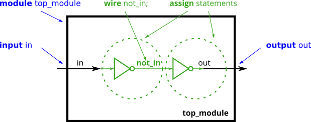
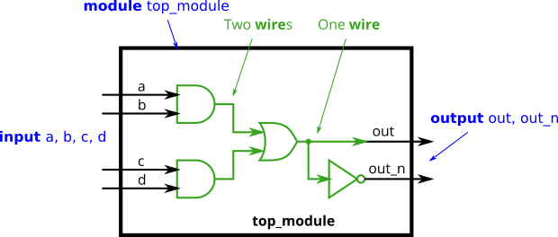
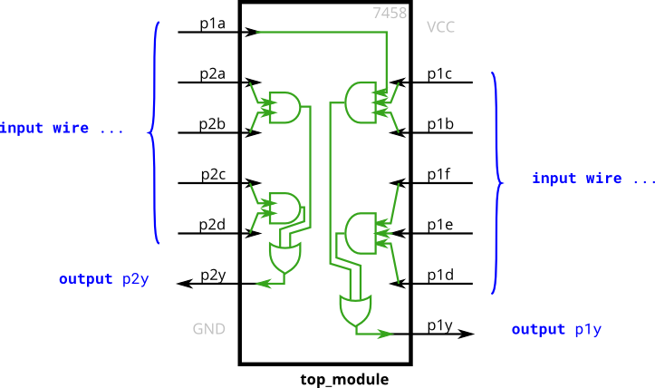

# basics

### 连续赋值

可以使用`{}`

```verilog
module top_module(
    input a,b,c,
    output w,x,y,z );
    assign {w,x,y,z} = {a,b,b,c};
endmodule
```

### 非门

有两种"非", 一种是`~`, 一种是`!`

如果只有一个bit, 那么就不重要

```verilog
module top_module( input in, output out );
	assign out = ~in;
endmodule
```

### 与门

有两种"与门", 一种是`&&`, 一种是`&`

如果只有一个bit, 那么就不重要

```verilog
module top_module(
    input a,
    input b,
    output out );
	assign out = a & b;
endmodule
```

### 或非门

有两种"或门", 一种是`||`, 一种是`|`

如果只有一个bit, 那么就不重要

```verilog
module top_module(
    input a,
    input b,
    output out );
    assign out = ~(a | b);
endmodule
```

### 同或门(异或取反)

verilog中没有 逻辑的异或, 只有按位异或

```verilog
module top_module(
    input a,
    input b,
    output out );
    assign out = ~(a^b);
endmodule
```

### declaring wires(类似于声明临时变量)

example:



```verilog
module top_module (
    input in,              // Declare an input wire named "in"
    output out             // Declare an output wire named "out"
);

    wire not_in;           // Declare a wire named "not_in"

    assign out = ~not_in;  // Assign a value to out (create a NOT gate).
    assign not_in = ~in;   // Assign a value to not_in (create another NOT gate).

endmodule   // End of module "top_module"
```

example



```verilog
module top_module(
    input a,
    input b,
    input c,
    input d,
    output out,
    output out_n   );
	wire and_a_b, and_c_d, out_or;
    assign {and_a_b, and_c_d} = {a & b, c & d};
    assign out_or = and_a_b | and_c_d;
    assign {out, out_n} = {out_or, ~out_or};
endmodule
```

### 练习, 封装7458



```verilog
module top_module (
    input p1a, p1b, p1c, p1d, p1e, p1f,
    output p1y,
    input p2a, p2b, p2c, p2d,
    output p2y );
	wire and_p2a_p2b, and_p2c_p2d, and_p1a_p1c_p1b, and_p1f_p1e_p1d;

    assign {and_p2a_p2b, and_p2c_p2d, and_p1a_p1c_p1b, and_p1f_p1e_p1d} = {p2a & p2b, p2c & p2d, p1a & p1c & p1b, p1f & p1e & p1d};
    assign {p2y, p1y} = {and_p2c_p2d | and_p2a_p2b, and_p1a_p1c_p1b | and_p1f_p1e_p1d};

endmodule
```

### 移位寄存器

```verilog
a[7:0] = {a[0], a[7, 1]};
```

### assign

`assign` 语句之前是并发的

一些公司规定: assign就代表了: 组合逻辑电路

### always

这个`always`是过程块, 这个就可以理解成pascal中的"过程"

### init

init是默认执行的, 不用任何的信号
