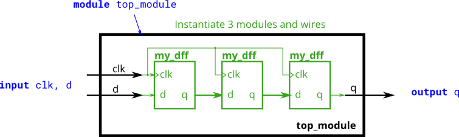

# module

### 按照位置连接端口, 按照名称连接端口

推荐按照名称连接端口

```verilog
mod_a instance2 ( .out(wc), .in1(wa), .in2(wb) );
```

使用模块, 创建实例

```verilog
module top_module (
	input a,
	input b,
	output out
);

	// Create an instance of "mod_a" named "inst1", and connect ports by name:
	mod_a inst1 (
		.in1(a), 	// Port"in1"connects to wire "a"
		.in2(b),	// Port "in2" connects to wire "b"
		.out(out)	// Port "out" connects to wire "out"
				// (Note: mod_a's port "out" is not related to top_module's wire "out".
				// It is simply coincidence that they have the same name)
	);

/*
	// Create an instance of "mod_a" named "inst2", and connect ports by position:
	mod_a inst2 ( a, b, out );	// The three wires are connected to ports in1, in2, and out, respectively.
*/

endmodule
```

### 按照位置连接端口

因为`verilog`里面, 有端口, 也有参数

对于一个物理的硬件来说, 对外显现的是端口

但是有时候, 会指定一些参数, 这个参数就像是C++中的, 全局的static const变量

```verilog
module top_module (
    input a,
    input b,
    input c,
    input d,
    output out1,
    output out2
);
    mod_a inst1(out1, out2, a,b,c,d);
endmodule
```

### 按照名字连接端口

```verilog
module top_module (
    input a,
    input b,
    input c,
    input d,
    output out1,
    output out2
);
    mod_a inst1(
    	.out1(out1), .out2(out2),
        .in1(a), .in2(b), .in3(c), .in4(d)
    );
endmodule
```

### D触发器



其中中间的`my_dff`是移位寄存器

```verilog
module top_module ( input clk, input d, output q );
    wire mid1, mid2;
    my_dff inst1(.clk(clk), .d(d), .q(mid1));
    my_dff inst2(.clk(clk), .d(mid1), .q(mid2));
    my_dff inst3(.clk(clk), .d(mid2), .q(q));
endmodule
```

### 类似于多路选择器

```verilog
module top_module (
    input clk,
    input [7:0] d,
    input [1:0] sel,
    output [7:0] q
);
    wire [7:0] mid1, mid2, mid3;
    my_dff8 inst1 (.clk(clk), .d(d), .q(mid1));
    my_dff8 inst2 (.clk(clk), .d(mid1), .q(mid2));
    my_dff8 inst3 (.clk(clk), .d(mid2), .q(mid3));
    always @(*)
    begin
        case (sel)
            2'b00: q = d;
            2'b01: q = mid1;
            2'b10: q = mid2;
            2'b11: q = mid3;
        endcase
    end
endmodule
```

### 16位加法器 合成 32位加法器


```verilog
module top_module(
    input [31:0] a,
    input [31:0] b,
    output [31:0] sum
);
    wire [15:0] hi_a, hi_b, lo_a, lo_b, hi_sum, lo_sum;
    wire ca, cb;
    assign {hi_a, lo_a, hi_b, lo_b} = {a[31:16], a[15:0], b[31:16], b[15:0]};
    add16 inst_lo(.a(lo_a), .b(lo_b), .cin(0), .cout(ca), .sum(lo_sum));
    add16 inst_hi(.a(hi_a), .b(hi_b), .cin(ca), .cout(cb), .sum(hi_sum));
    assign sum = {hi_sum, lo_sum};
endmodule
```

### 构建一位全加器

```verilog
module top_module (
    input [31:0] a,
    input [31:0] b,
    output [31:0] sum
);//
    wire [15:0] hi_a, hi_b, lo_a, lo_b, hi_sum, lo_sum;
    wire ca, cb;
    assign {hi_a, lo_a, hi_b, lo_b} = {a[31:16], a[15:0], b[31:16], b[15:0]};
    add16 inst_lo(.a(lo_a), .b(lo_b), .cin(0), .cout(ca), .sum(lo_sum));
    add16 inst_hi(.a(hi_a), .b(hi_b), .cin(ca), .cout(cb), .sum(hi_sum));
    assign sum = {hi_sum, lo_sum};
endmodule

module add1 ( input a, input b, input cin,   output sum, output cout );

// Full adder module here
    assign {sum, cout} = {a ^ b ^ cin, a & b | a & cin | b & cin};
endmodule
```
