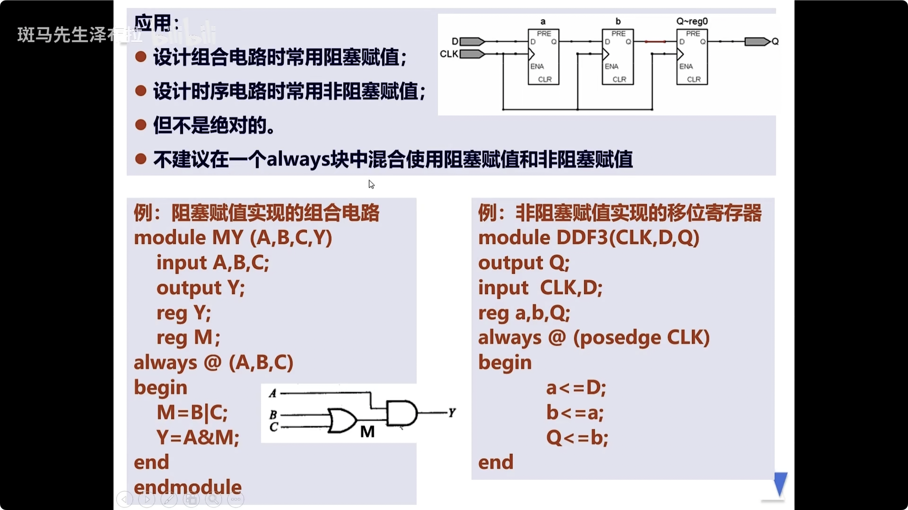
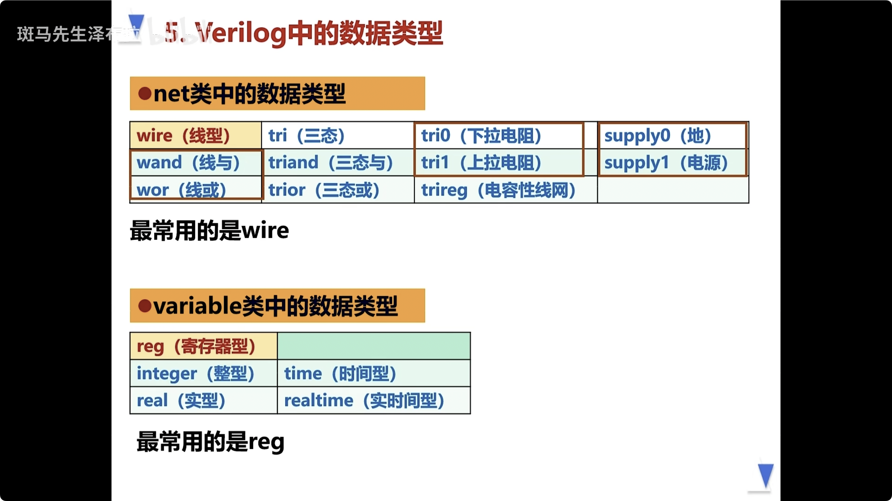
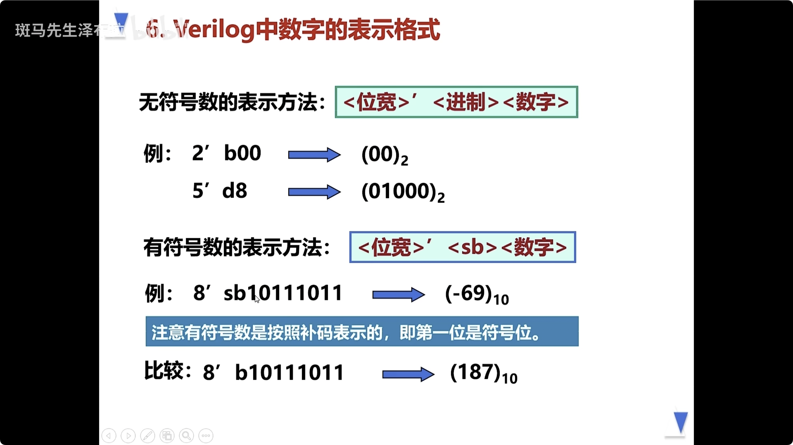
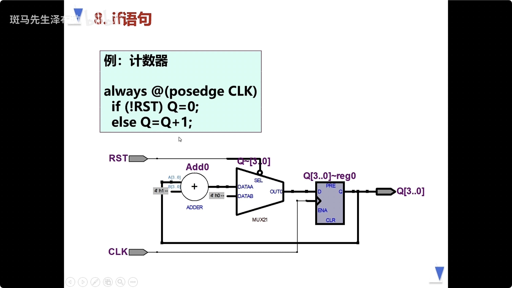
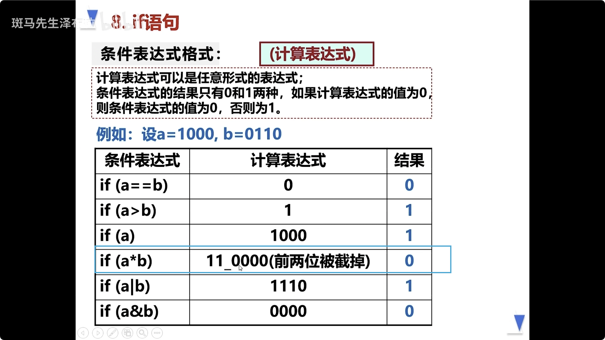
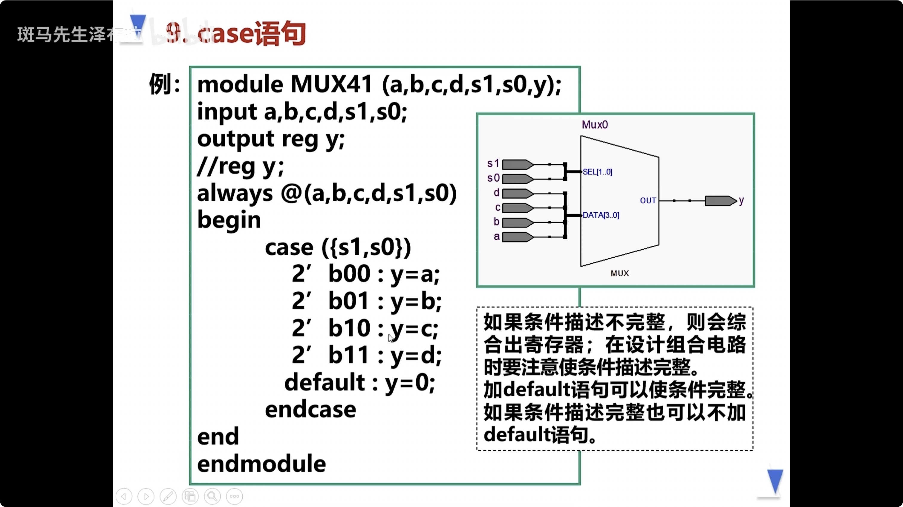
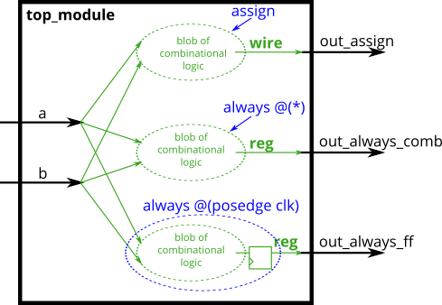

# procedure

verilog规定, assign中的赋值目标, 一定是wire类型,
always中的赋值目标, 一定是reg类型

举一个例子

```verilog
module DFF2(CLK, D, Q, RST, EN)
    input CLK, D, RST, EN;
    output Q;
    reg Q;  // 当我们看到reg的时候, 就可以想到会用在always中
    always @(posedge CLK or negedge RST)
    begin
        if (!RST) Q <= 0;
        else if (EN) Q <= D;
    end
endmodule
```

这个`always @(posedge CLK or negedge RST)`是比较标准的

RST是复位信号

上面是一个比较标准的D触发器了

always中, 推荐都加上begin/end

### 时序和组合

不能在一个always语句块中, 混合使用阻塞赋值和非阻塞赋值



```verilog
module DDF3(CLK, D, Q)
    output Q;
    input CLK, D;
    reg a, b, Q;
    always @(posedge CLK)
    begin
        a <= D;
        b <= a;
        Q <= b;
    end
endmodule
```

上面这个意味着什么? clk打了两拍以后, D才会赋值到Q中

在后面学习到 "亚稳态" 的时候, 会用到这个东西

上面这个可以消除 "亚稳态"

然后直接想法就是: 用阻塞赋值, 实现了: 移位寄存器

### verilog中的数据类型



简单来说:

- net型主要是wire
- variable型, 主要是reg

a. 如果是连续赋值, 或者是: 门原语(也就是创建实例之类的),
那么就是使用wire型

如果是过程赋值(procedure, always), 那么就是reg型

b. 对于端口信号来说, input信号和inout(双向)信号必须定义成wire型

output信号, 可以定义成wire型, 也可以定义成reg型,
取决于如何对其赋值(同a)

inout出现的比较少,
但是比方说书上一些元件, 一些线确实是可以双向的;
或者是一些CLK信号, 就会定义成inout

### 什么是 always \*

> 在Verilog中，`always @(*)`中的`*`表示“任何信号变化”。这意味着在`always`块中，无论哪个信号发生变化，都会触发该块内的代码执行。这种语法通常用于组合逻辑的描述，以便自动检测输入信号的变化并更新输出信号。

> 在数字电路中，信号可以是任何电子或数字量，例如时钟信号、输入/输出信号、状态信号、控制信号等。信号可以是单个位（0或1）或多位二进制数。在Verilog中，信号可以是wire、reg或其他数据类型。

> 是的，中间创建的`wire`类型数据和`reg`类型数据也可以被视为信号。在Verilog中，`wire`用于表示组合逻辑的输出信号，而`reg`用于表示时序逻辑的状态信号。这些数据类型都可以被视为在电路中传递的信号，用于连接模块之间的输入和输出。因此，这些中间创建的`wire`和`reg`类型数据也可以被称为信号。

### always ,

> 在Verilog中，`always @()`中的`,`表示敏感列表中不同信号之间的分隔符。敏感列表用于指定在`always`块中触发代码执行的信号。每个信号之间使用逗号`,`进行分隔。当敏感列表中的任何一个信号发生变化时，`always`块内的代码将被执行。逗号`,`的作用是将多个信号组合在一起，以便同时监测它们的变化。

### 数字的表示形式



有符号数, 需要标明`8'sb`, 这里的s应该是signed的意思

### 逻辑值

0, 1, x(不定态), z(高阻态)

### if

例子: 计数器



在使用if语句的时候, 一般是要保证条件完整的(有if就要有else)

### 注意被截断的情况



### case default

有case一定要有endcase

然后一般是要有default的

### 综合出reg



条件不完整, 那么就会综合出reg, 这固然是不好的

### verilog的三种描述方法

1. 结构化描述, 全部用(门原语 和 底层模块调用)
2. 数据流描述, 全部用 assign
3. 行为级描述, 全部用always语句, 配合if, case语句

还有一种描述形式, RTL级(数据流级 + 行为级, 可综合成门级的形式)

行为级描述是平常写的时候最多的

### 不可综合的一些情况

在Verilog中，有一些语句或结构是不可综合的，即无法被硬件综合工具转换为实际的电路。以下是一些常见的不可综合情况：

1. `initial`语句：`initial`语句只能在测试台（testbench）中使用，不能被综合为硬件电路。它主要用于模拟行为和测试。

2. 带有时间控制的语句：Verilog中的时间控制符号（如`#10`）用于模拟时间延迟或等待特定时间。这些语句在综合时通常会被忽略，因为硬件电路的行为是基于时钟触发而不是时间。

3. 循环语句：Verilog中的某些循环语句（如`forever`、`while`）在综合时无法确定循环次数，因此也无法被综合为硬件电路。

4. 用户自定义原语（UDP元件）：综合工具通常只支持特定的标准逻辑元件，无法综合用户自定义的原语。

5. 一些数据类型和操作：某些数据类型（如`real`、`time`）以及某些操作（如`force`、`release`）在综合时可能无法被支持。

6. 非阻塞赋值和阻塞赋值：在时序逻辑中，使用非阻塞赋值（`<=`）可以确保正确的信号更新顺序。然而，阻塞赋值（`=`）在组合逻辑中更常见。综合工具通常建议在时序逻辑中使用非阻塞赋值，但在组合逻辑中可以使用阻塞赋值。

这些是一些常见的不可综合情况，但具体情况可能因综合工具和目标设备而异。在编写Verilog代码时，应尽量避免使用不可综合的语句或结构，以确保代码可以正确地转换为硬件电路。

### 一些小作业

#### assign 语句和 always语句的特点

`assign`语句和`always`语句是Verilog中两个常用的结构。

`assign`语句用于在组合逻辑中创建输出。它类似于C语言中的常量赋值，只不过它是基于输入信号的值计算输出信号的值。`assign`语句通常用于描述简单的布尔逻辑或多路选择器。`assign`语句的特点是：

- `assign`语句是组合逻辑，没有时序延迟。
- `assign`语句可以用于连接多个模块之间的信号。
- `assign`语句只能用于描述简单的逻辑，不能包含复杂的状态转换。

`always`语句用于描述时序逻辑。它类似于C语言中的函数，可以根据时钟信号或其他触发条件执行代码块。`always`语句通常用于描述状态机、寄存器以及其他需要存储状态的电路。`always`语句的特点是：

- `always`语句是时序逻辑，具有时序延迟。
- `always`语句可以包含多个语句块，用于描述复杂的状态转换。
- `always`语句必须包含敏感列表，以指定在何时执行代码块。

#### 说明阻塞赋值和非阻塞赋值的特点

在Verilog中，阻塞赋值和非阻塞赋值是两种常用的赋值语句。它们的主要区别在于信号更新的顺序和时序逻辑的行为。

阻塞赋值（`=`）是一种顺序执行的赋值语句。在执行阻塞赋值语句时，会按照语句的顺序依次执行，并且在执行完当前语句之前，不会执行下一个语句。这意味着如果有多个阻塞赋值语句，后面的语句会覆盖前面的语句。阻塞赋值通常用于组合逻辑中。

非阻塞赋值（`<=`）是一种并发执行的赋值语句。在执行非阻塞赋值语句时，所有的语句都会同时执行，并且不会互相干扰。这意味着如果有多个非阻塞赋值语句，后面的语句不会影响前面的语句。非阻塞赋值通常用于时序逻辑中，用于描述状态转换。

总之，阻塞赋值和非阻塞赋值在Verilog中都有其特定的用途。阻塞赋值用于描述组合逻辑，而非阻塞赋值用于描述时序逻辑。在时序逻辑中，通常使用非阻塞赋值来确保正确的信号更新顺序。

#### 说明wire和reg数据类型的特点

在Verilog中，`wire`和`reg`是两种常用的数据类型。

`wire`用于表示组合逻辑的输出信号，它是一种连续赋值的数据类型。`wire`类型的信号可以由多个模块共享，因此它通常用于连接多个模块之间的信号。`wire`类型的特点是：

- `wire`类型的信号只能在赋值语句中使用。
- `wire`类型的信号不能存储状态，因为它是连续赋值的。
- `wire`类型的信号可以用于描述任何组合逻辑，包括简单的布尔逻辑和多路选择器。

`reg`用于表示时序逻辑的状态信号，它是一种存储赋值的数据类型。`reg`类型的信号可以存储状态，并且可以在时序逻辑中使用。`reg`类型的特点是：

- `reg`类型的信号可以在赋值语句和过程块中使用。
- `reg`类型的信号可以存储状态，并且可以在时序逻辑中使用。
- `reg`类型的信号通常用于描述状态机、寄存器以及其他需要存储状态的电路。

总之，`wire`和`reg`是Verilog中两种常用的数据类型。它们分别用于表示组合逻辑和时序逻辑，并具有不同的特点。

#### 分别用assign语句和always语句设计四选一数据选择器

使用`assign`语句和`always`语句分别设计四选一数据选择器的示例如下：

使用`assign`语句：

```verilog
module FourToOneMux (
  input wire sel[1:0],
  input wire data[3:0],
  output reg out
);

  assign out = (sel == 2'b00) ? data[0] :
               (sel == 2'b01) ? data[1] :
               (sel == 2'b10) ? data[2] :
                                data[3];

endmodule
```

使用`always`语句：

```verilog
module FourToOneMux (
  input wire sel[1:0],
  input wire data[3:0],
  output reg out
);

  always @*
    case(sel)
      2'b00: out = data[0];
      2'b01: out = data[1];
      2'b10: out = data[2];
      default: out = data[3];
    endcase

endmodule
```

这两种设计都实现了四选一数据选择器，根据选择信号`sel`的值，将相应的输入数据`data`传递到输出信号`out`上。其中，`assign`语句在组合逻辑中直接对输出信号进行赋值，而`always`语句在时序逻辑中使用`case`语句根据选择信号的值进行赋值。

### always assign



```verilog
// synthesis verilog_input_version verilog_2001
module top_module(
    input clk,
    input a,
    input b,
    output wire out_assign,
    output reg out_always_comb,
    output reg out_always_ff   );
	assign out_assign = a ^ b;
    always @(*)
        begin
            out_always_comb = a ^ b;
        end
    always @(posedge clk)
        begin
            out_always_ff = a ^ b;
        end
endmodule
```

### 三目运算符 与 if else

```verilog
// synthesis verilog_input_version verilog_2001
module top_module(
    input a,
    input b,
    input sel_b1,
    input sel_b2,
    output wire out_assign,
    output reg out_always   );
    assign out_assign = (sel_b1) ? ((sel_b2) ? b : a) : ((sel_b2)? a : a);
   	always @(*)
        begin
            if (sel_b1)
                begin
                    if (sel_b2)
                        begin
                            out_always = b;
                        end
                    else
                        begin
                            out_always = a;
                        end
                end
            else
                begin
                    if (sel_b2)
                        begin
                            out_always = a;
                        end
                  	else
                        begin
                            out_always = a;
                        end
                end
		end

endmodule
```

### avoid making latches

> 避免生成锁存器（latches）是指在设计数字电路时，应该尽量避免产生锁存器。锁存器是一种存储元件，可以在时钟信号的作用下存储数据。然而，生成锁存器可能会导致电路的行为变得复杂和不可预测。
> 在综合时，如果在组合逻辑中存在没有完全赋值的情况，综合工具可能会生成锁存器来存储这些未赋值的状态。这种情况通常是由于在条件语句中没有为所有可能的情况提供赋值而导致的。
> 生成锁存器的问题在于其行为不可预测，可能会导致电路的功能错误或时序问题。此外，锁存器会增加电路的复杂性和功耗。
> 因此，在设计数字电路时，应该避免生成锁存器。为了避免生成锁存器，应该始终确保在组合逻辑中对所有可能的情况进行完全赋值。这可以通过添加默认赋值或使用case语句等方式来实现。通过避免生成锁存器，可以提高电路的可靠性和性能。

也就是要让条件变全, 可以防止latches的出现

### case default

```verilog
// synthesis verilog_input_version verilog_2001
module top_module (
    input [2:0] sel,
    input [3:0] data0,
    input [3:0] data1,
    input [3:0] data2,
    input [3:0] data3,
    input [3:0] data4,
    input [3:0] data5,
    output reg [3:0] out   );//

    always@(*) begin  // This is a combinational circuit
        case(sel)
           	3'b000: out = data0;
            3'b001: out = data1;
            3'b010: out = data2;
            3'b011: out = data3;
            3'b100: out = data4;
            3'b101: out = data5;
            default: out = 0;
        endcase
    end

endmodule
```

一定要让: 条件变全

### casez与 优先级编码器

```verilog
// synthesis verilog_input_version verilog_2001
module top_module (
    input [3:0] in,
    output reg [1:0] pos  );
    always @(*)
        begin
            casez(in)
                4'bzzz1: pos = 2'b00;   // in[3:1] can be anything
                4'bzz10: pos = 2'b01;
                4'bz100: pos = 2'b10;
                4'b1000: pos = 2'b11;
                default: pos = 2'b00;
            endcase
        end
endmodule
```

### case避免latches(锁存器)

> To avoid creating latches, all outputs must be assigned a value in all possible conditions (See also always_if2). Simply having a default case is not enough. You must assign a value to all four outputs in all four cases and the default case. This can involve a lot of unnecessary typing. One easy way around this is to assign a "default value" to the outputs before the case statement:
> 为避免产生锁存器，必须在所有可能的条件下为所有输出分配一个值（另请参阅always_if2）。仅仅有一个案例是不够的。您必须为所有四种情况和默认情况下的所有四个输出分配一个值。这可能涉及大量不必要的键入。解决此问题的一种简单方法是在 case 语句之前为输出分配一个“默认值”：

```verilog
always @(*) begin
    // 设置默认值, 可以避免锁存器
    up = 1'b0; down = 1'b0; left = 1'b0; right = 1'b0;
    case (scancode)
        ... // Set to 1 as necessary.
    endcase
end
```

### 循环使用的地点

在Verilog中，`for` 循环通常出现在以下上下文中：

1. `always` 块：`for` 循环通常在 `always` 块中用于描述组合逻辑或时序逻辑。

2. `generate` 块：在 `generate` 块中，可以使用 `for` 循环来生成硬件实例或产生硬件结构。

3. 任务（task）或函数（function）：您可以在 Verilog 中定义任务和函数，其中可以包含 `for` 循环以执行一系列操作。

4. 初始块（`initial` block）：虽然不太常见，但您也可以在 `initial` 块中使用 `for` 循环来执行一系列初始化操作。

`for` 循环通常用于生成硬件结构、执行组合逻辑或在仿真中模拟操作。在时序逻辑中，通常会使用 `always` 块来描述状态机和时序操作。如果需要在时序逻辑中使用循环，通常会使用状态机来实现。

总之，`for` 循环不仅仅在 `always` 块中使用，它可以在不同的上下文中使用，具体取决于您的需求和设计目标。

### 循环语句之前, 一定要对寄存器进行初始化

```verilog
module top_module(
    input [254:0] in,
    output [7:0] out );
    integer i;
    reg [7:0] cnt;
    always @(*)
        begin
			cnt = 8'b0;
            for (i = 0; i <= 254; i = i + 1)
                begin
                    cnt = (in[i]) ? cnt + 1: cnt;
                end
            out = cnt;
        end
endmodule
```
