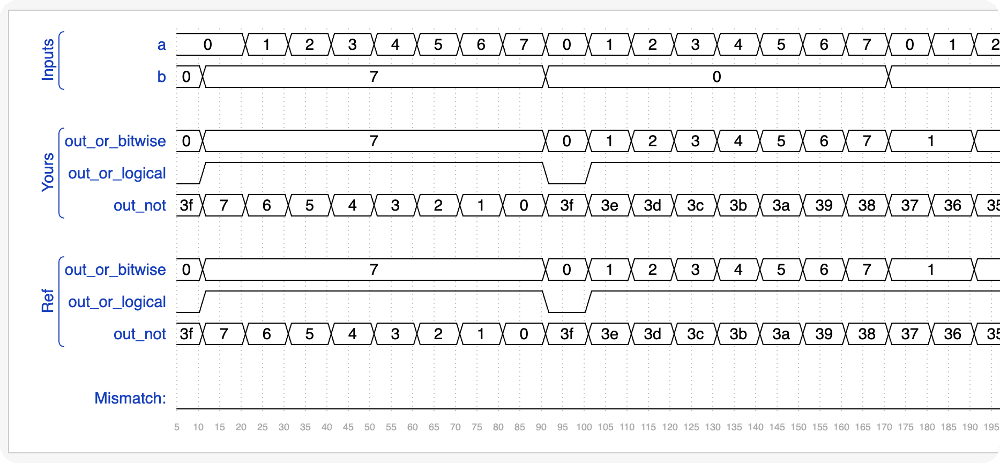
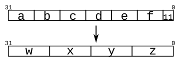

# vector

### 从向量中选择一个信号

```verilog
wire [99:0] my_vector;      // Declare a 100-element vector
assign out = my_vector[10]; // Part-select one bit out of the vector
```

### 向量赋值

```verilog
module top_module (
    input wire [2:0] vec,
    output wire [2:0] outv,
    output wire o2,
    output wire o1,
    output wire o0  ); // Module body starts after module declaration
    assign {outv[2:0], o2, o1, o0} = {vec[2:0], vec[2], vec[1], vec[0]};
endmodule
```

### 向量的字节序

> The endianness (or, informally, "direction") of a vector is whether the the least significant bit has a lower index (little-endian, e.g., [3:0]) or a higher index (big-endian, e.g., [0:3]). In Verilog, once a vector is declared with a particular endianness, it must always be used the same way. e.g., writing vec[0:3] when vec is declared wire [3:0] vec; is illegal. Being consistent with endianness is good practice, as weird bugs occur if vectors of different endianness are assigned or used together.
> 向量的字节序（或非正式地称为“方向”）是最低有效位是否具有较低的索引（小端序，例如 [3：0]）或较高的索引（大端序，例如 [0：3]）。在 Verilog 中，一旦向量声明具有特定的字节序，就必须始终以相同的方式使用它。例如，在宣布时书写是非法的。与字节序保持一致是一种很好的做法，因为如果将不同字节序的向量分配或一起使用，就会出现奇怪的错误。

"字节序" 与 "声明" 的相反, 这个是illegal的

### 隐式网格(implicitly nets)

隐式转换, 这个在C语言中, 也是很坑的东西之一

```verilog
wire [2:0] a, c;   // Two vectors
assign a = 3'b101;  // a = 101
assign b = a;       // b =   1  implicitly-created wire
assign c = b;       // c = 001  <-- bug
my_module i1 (d,e); // d and e are implicitly one-bit wide if not declared.
                    // This could be a bug if the port was intended to be a vector.
```

"向量" 和 "标量" 并不是类型匹配的, 注意

### packed array

```verilog
reg [7:0] mem [255:0];   // 256 unpacked elements, each of which is a 8-bit packed vector of reg.
reg mem2 [28:0];         // 29 unpacked elements, each of which is a 1-bit reg.
```

### 部分选取

```verilog
w[3:0]      // Only the lower 4 bits of w
x[1]        // The lowest bit of x
x[1:1]      // ...also the lowest bit of x
z[-1:-2]    // Two lowest bits of z
b[3:0]      // Illegal. Vector part-select must match the direction of the declaration.
b[0:3]      // The *upper* 4 bits of b.
assign w[3:0] = b[0:3];    // Assign upper 4 bits of b to lower 4 bits of w. w[3]=b[0], w[2]=b[1], etc.
```

拆分高低位

```verilog
`default_nettype none     // Disable implicit nets. Reduces some types of bugs.
module top_module(
    input wire [15:0] in,
    output wire [7:0] out_hi,
    output wire [7:0] out_lo );
    assign {out_hi[7:0], out_lo[7:0]} = {in[15:8], in[7:0]};
endmodule
```

### 练习: 翻转字节(8个bits)

```verilog
module top_module(
    input [31:0] in,
    output [31:0] out );//
    // assign out[31:24] = ...;
    assign {out[31:24], out[23:16], out[15:8], out[7:0]} = {in[7:0], in[15:8], in[23:16], in[31:24]};
endmodule
```

### 按位或 与 逻辑或

```verilog
module top_module(
    input [2:0] a,
    input [2:0] b,
    output [2:0] out_or_bitwise,
    output out_or_logical,
    output [5:0] out_not
);
    assign {out_or_bitwise[2:0], out_or_logical, out_not[5:3], out_not[2:0]} = {a | b, a || b, ~b, ~a};
endmodule
```



### 归约 运算

```verilog
module top_module(
    input [3:0] in,
    output out_and,
    output out_or,
    output out_xor
);
    assign {out_and, out_or, out_xor} = {&in, |in, ^in};

endmodule
```

### concate

```verilog
input [15:0] in;
output [23:0] out;
assign {out[7:0], out[15:8]} = in;         // Swap two bytes. Right side and left side are both 16-bit vectors.
assign out[15:0] = {in[7:0], in[15:8]};    // This is the same thing.
assign out = {in[7:0], in[15:8]};       // This is different. The 16-bit vector on the right is extended to
                                        // match the 24-bit vector on the left, so out[23:16] are zero.
                                        // In the first two examples, out[23:16] are not assigned.
```

> 这个concate运算符非常实用, 比方说在做 "移位运算" 的时候, 还是会用到这个的(西安电子)

练习:



```verilog
module top_module (
    input [4:0] a, b, c, d, e, f,
    output [7:0] w, x, y, z );//

    // assign { ... } = { ... };
    assign {w[7:0], x[7:0], y[7:0], z[7:0]} = {a[4:0], b[4:0], c[4:0], d[4:0], e[4:0], f[4:0], 2'b11};
endmodule
```

### 练习: 翻转向量bit

```verilog
module top_module(
    input [7:0] in,
    output [7:0] out
);
    assign {out[0], out[1], out[2], out[3], out[4], out[5], out[6], out[7]} = in;
endmodule
```

### 多重concate

```verilog
{5{1'b1}}           // 5'b11111 (or 5'd31 or 5'h1f)
{2{a,b,c}}          // The same as {a,b,c,a,b,c}
{3'd5, {2{3'd6}}}   // 9'b101_110_110. It's a concatenation of 101 with
                    // the second vector, which is two copies of 3'b110.
```

练习: 位扩展

```verilog
module top_module (
    input [7:0] in,
    output [31:0] out );//

    // assign out = { replicate-sign-bit , the-input };
    assign out = {{24{in[7]}},in[7:0]};

endmodule
```

### 连续 多重concate

```verilog
module top_module (
    input a, b, c, d, e,
    output [24:0] out );

    // The output is XNOR of two vectors created by
    // concatenating and replicating the five inputs.
    wire [24:0] mid1, mid2;
    assign {mid1, mid2} = {{{5{a}}, {5{b}}, {5{c}}, {5{d}}, {5{e}}}, {5{a,b,c,d,e}}};
    assign out = ~(mid1 ^ mid2);

endmodule
```

### 进位选择加法器

always一定要加入default

```verilog
module top_module(
    input [31:0] a,
    input [31:0] b,
    output [31:0] sum
);
    wire [15:0] sum_lo, sum_hi, sum_hi1, sum_hi2;
    wire c_mid, drop;
    add16 inst1(.a(a[15:0]), .b(b[15:0]), .cin(0),.sum(sum_lo), .cout(c_mid));
    add16 inst2(.a(a[31:16]), .b(b[31:16]), .cin(0),.sum(sum_hi1), .cout(drop));
    add16 inst3(.a(a[31:16]), .b(b[31:16]), .cin(1),.sum(sum_hi2), .cout(drop));
    always @(*)
    begin
        case (c_mid)
            1: sum_hi = sum_hi2;
            0: sum_hi = sum_hi1;
            default: sum_hi = 32'b0;
        endcase
    end
    assign sum = {sum_hi, sum_lo};

endmodule
```

### 加减器

```verilog
module top_module(
    input [31:0] a,
    input [31:0] b,
    input sub,
    output [31:0] sum
);
    wire [31:0] bb;
    wire [15:0] sum_lo, sum_hi;
    wire c_mid;
    assign bb = {32{sub}} ^ b;
    add16 inst1(.a(a[15:0]), .b(bb[15:0]), .cin(sub), .sum(sum_lo), .cout(c_mid));
    add16 inst2(.a(a[31:16]), .b(bb[31:16]), .cin(c_mid), .sum(sum_hi));
    assign sum = {sum_hi, sum_lo};

endmodule
```
