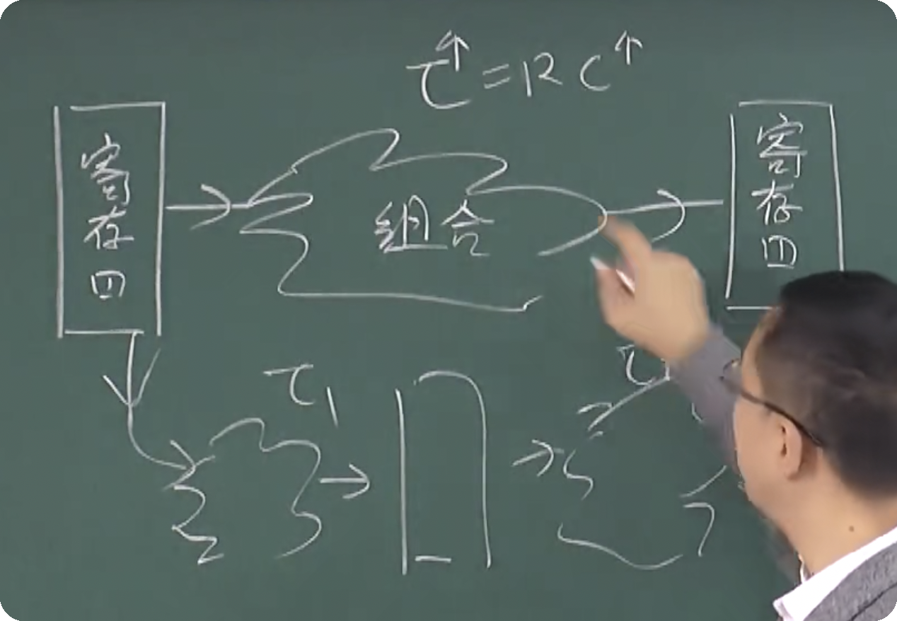

# 行为级建模

### 时序逻辑电路

三大方程:

1. 输出方程
2. 状态方程
3. 状态转移方程

流水线的意义: 组合电路是一个容性电路, 最大延迟由`τ=RC`决定

组合逻辑电路越大, 那么最大延迟就会很大

所以很多情况下, 会拆成多个组合逻辑电路,
然后中间通过一组寄存器(也就是流水线), 保存状态

计算器有14级以上的流水线

通常: cpu主频率越高, 那么寄存器就越多
