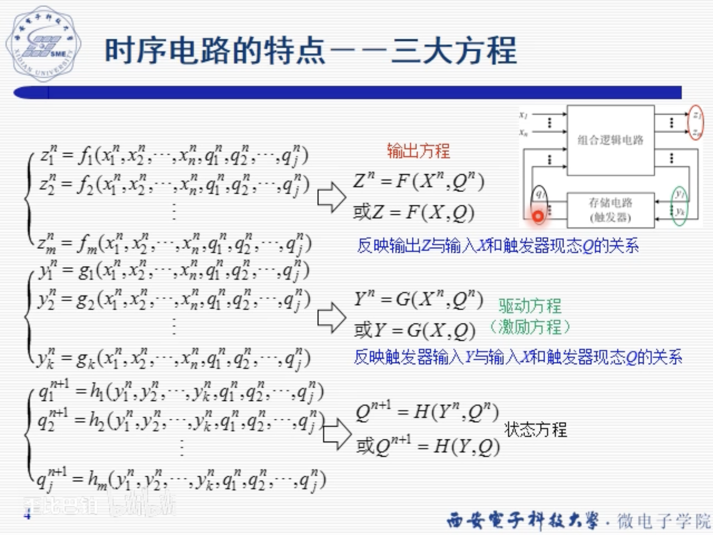
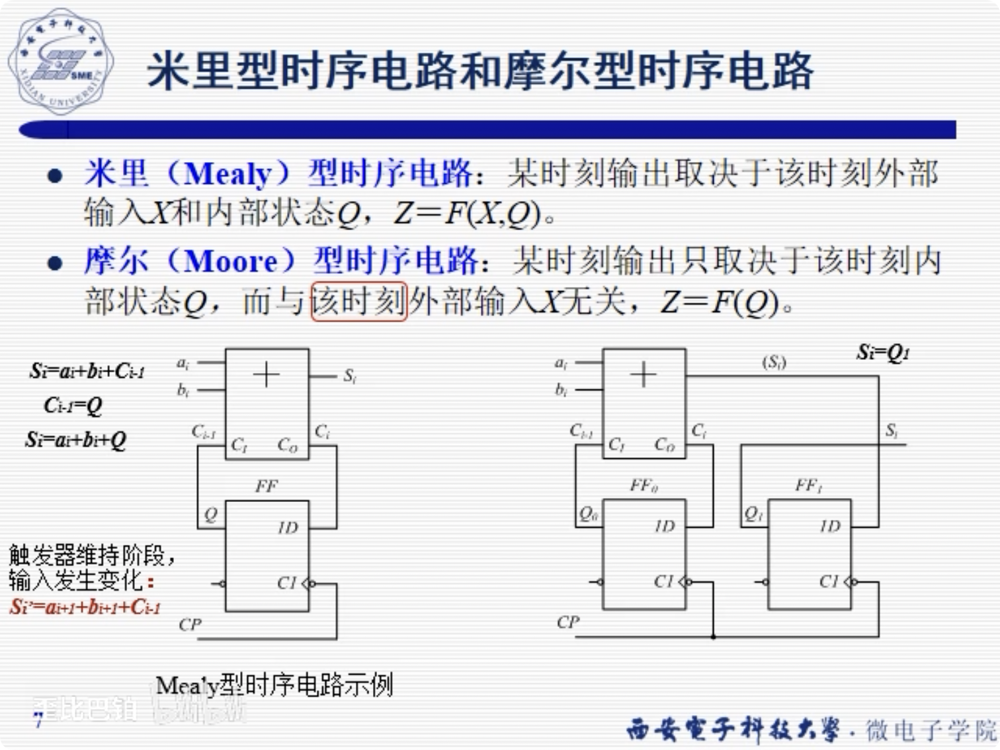
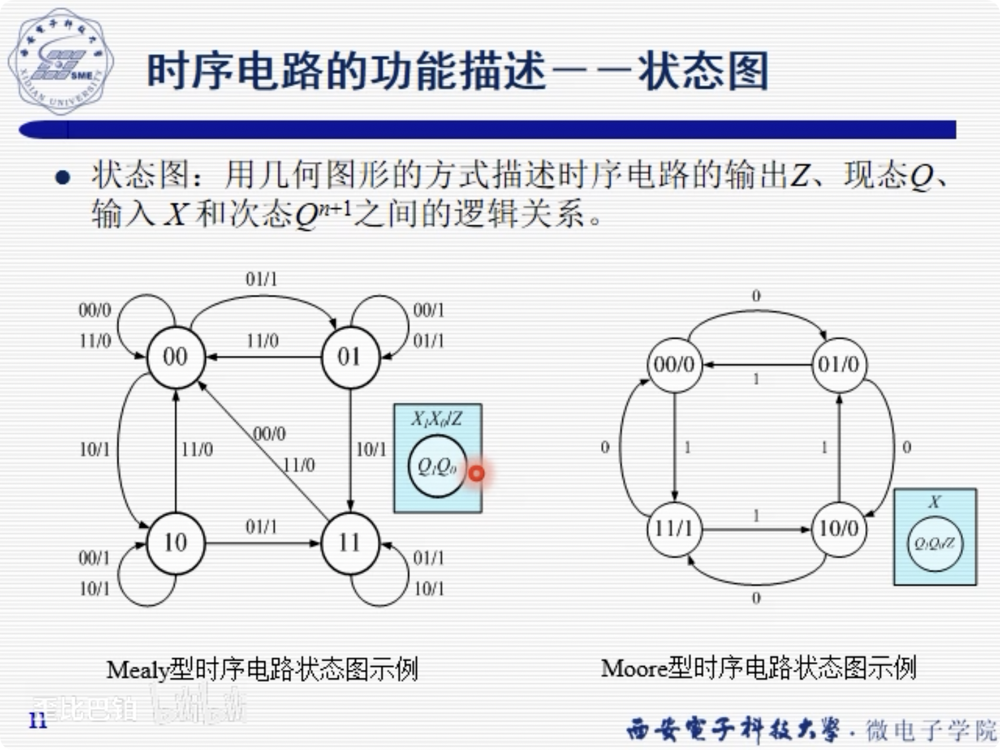
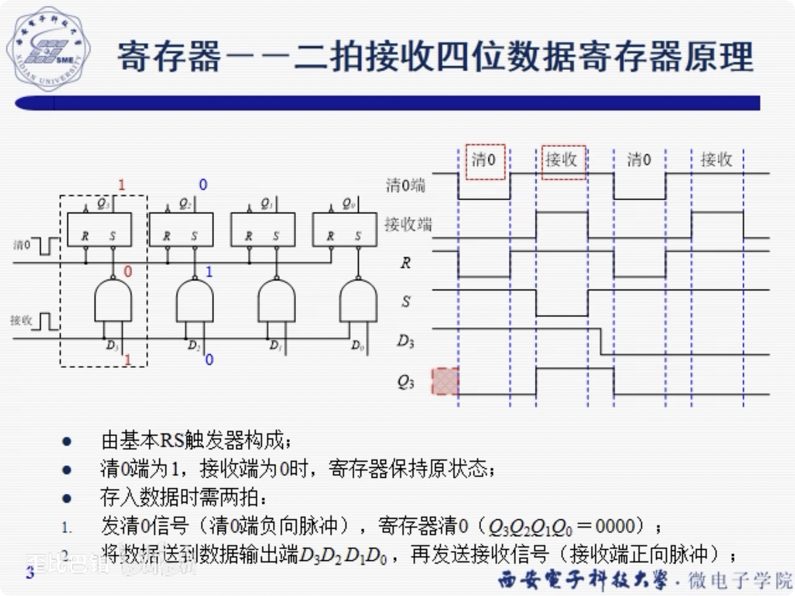
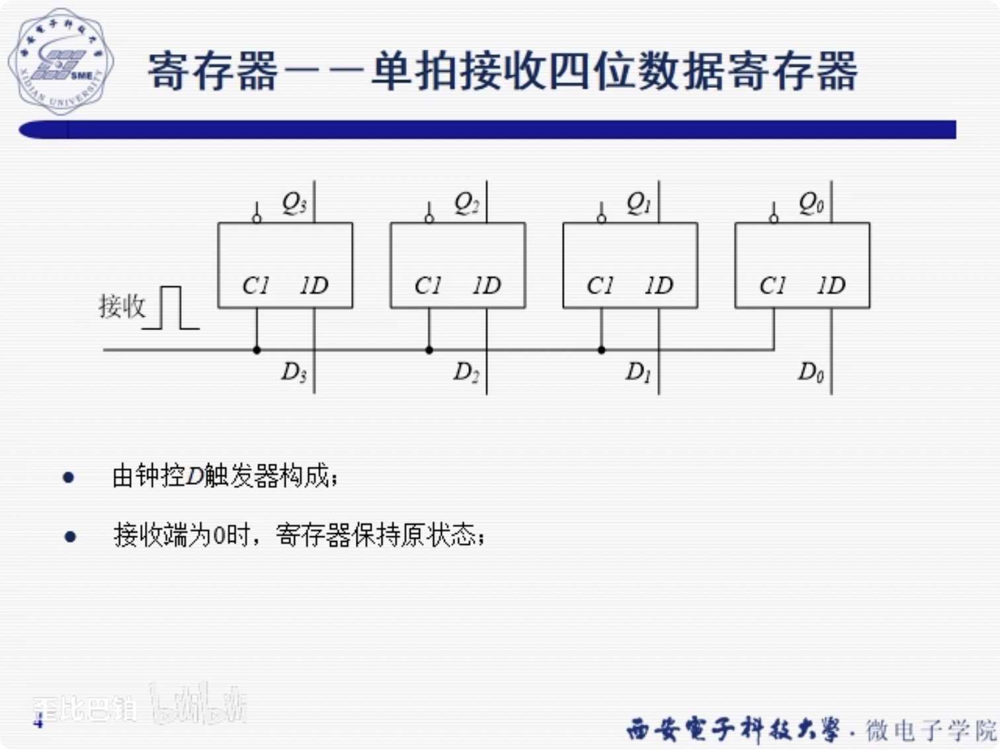
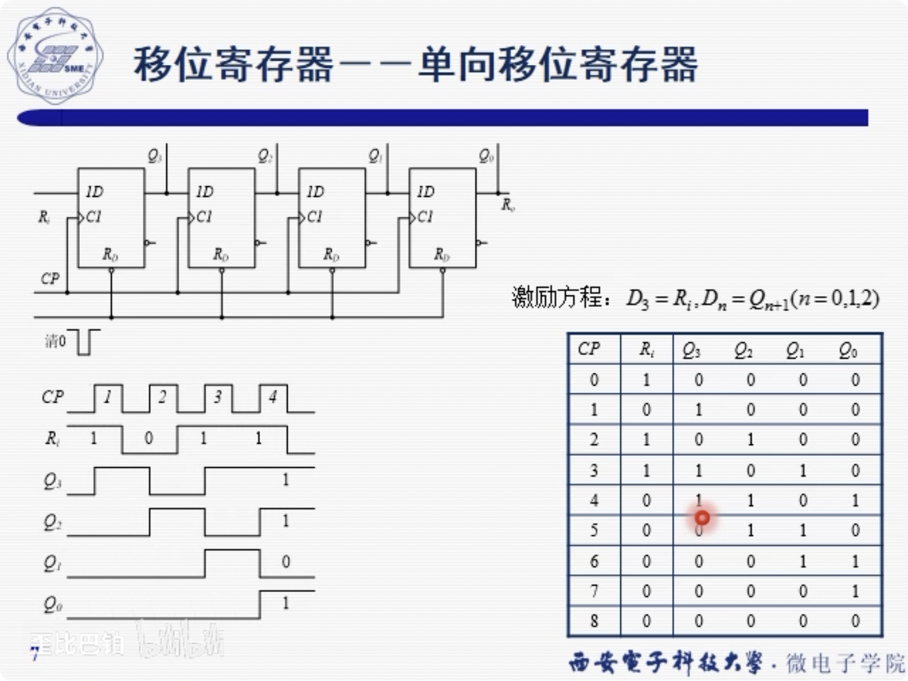
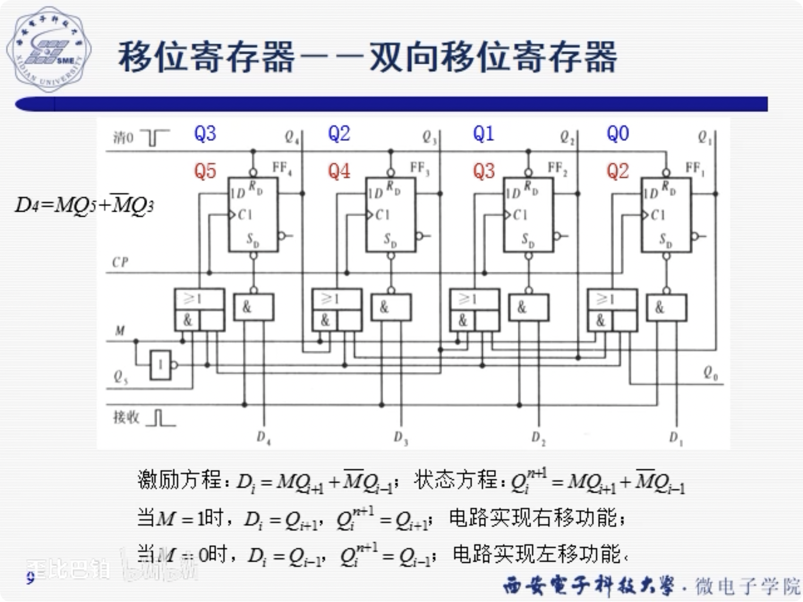
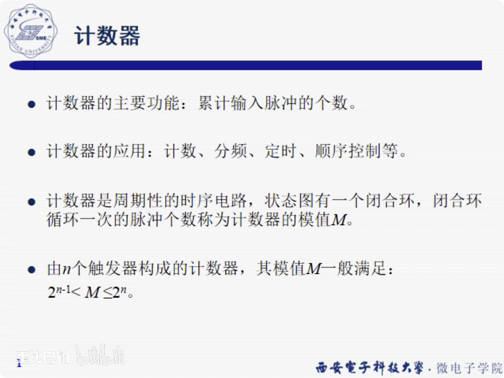
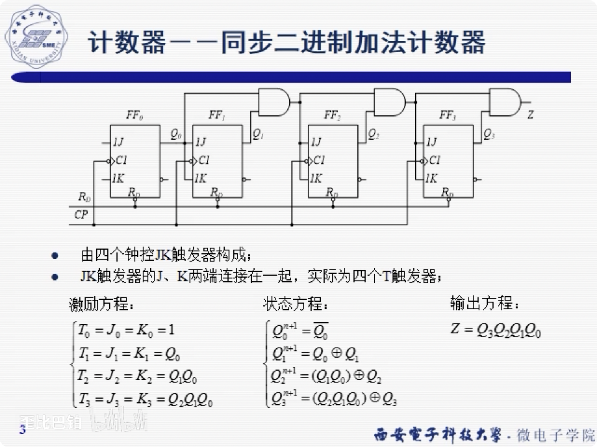
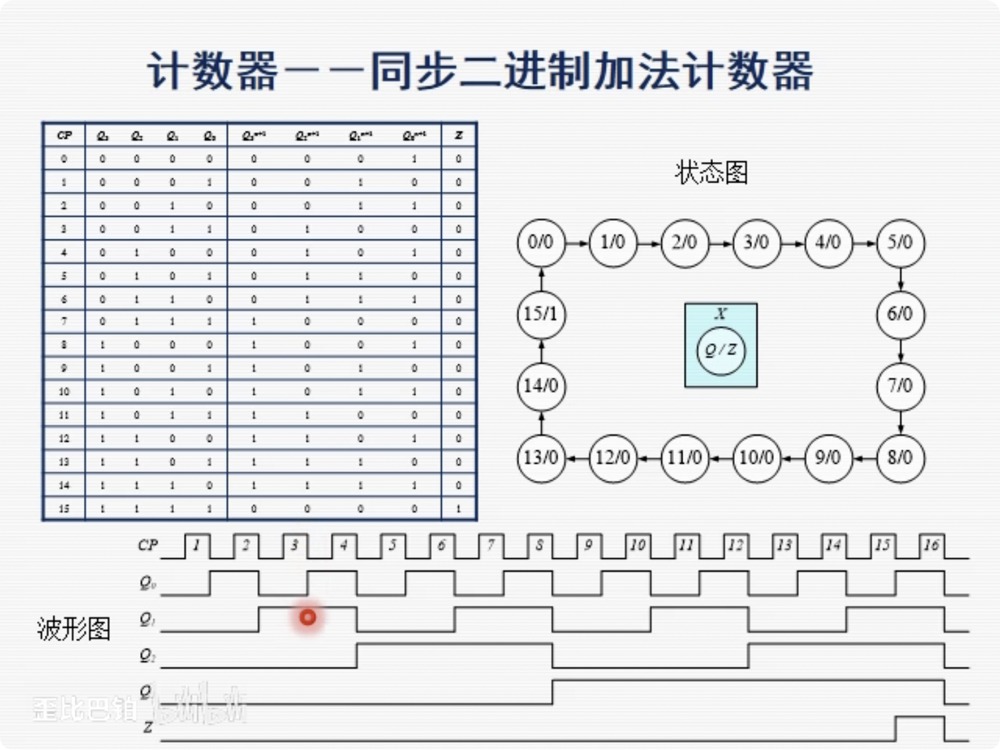

# 时序逻辑电路

### 时序电路概述

#### 三大方程

输出方程Z(F)

激励方程Y(G)

状态方程Q(H)

#### 同步电路 异步电路

同步就是: 统一时钟节拍进行变换

异步就是: 如果上一级输出有发生改变, 上升沿, 那么就会发生改变

#### mealy型时序电路, moore形时序电路

#### 状态表

### 寄存器

#### 二拍接收思维数据寄存器原理(电平触发器)

这个"拍", 意思应该是有几种不同的节拍

#### 单拍接收四位数据寄存器

#### 移位寄存器

对于串行输入的寄存器

数据需要移位, 或者是: 并->串, 串->并

移位可以是: 左移, 右移, 逻辑, 算术, 循环移位

### 计数器

计数器是周期性的时序电路, 状态图有一个闭合环,
闭合环循环一次的脉冲个数成为计数器的模值

就是M要大于某一个数呢?

如果M小于2^(n-1), 那么实际上只用n-1个寄存器就好了,
不然就浪费了

#### 同步二进制加法计数器

原理图

状态图

#### 同步十进制可逆计数器(既可以实现加法, 也可以实现减法)

状态转移图(mealy)
