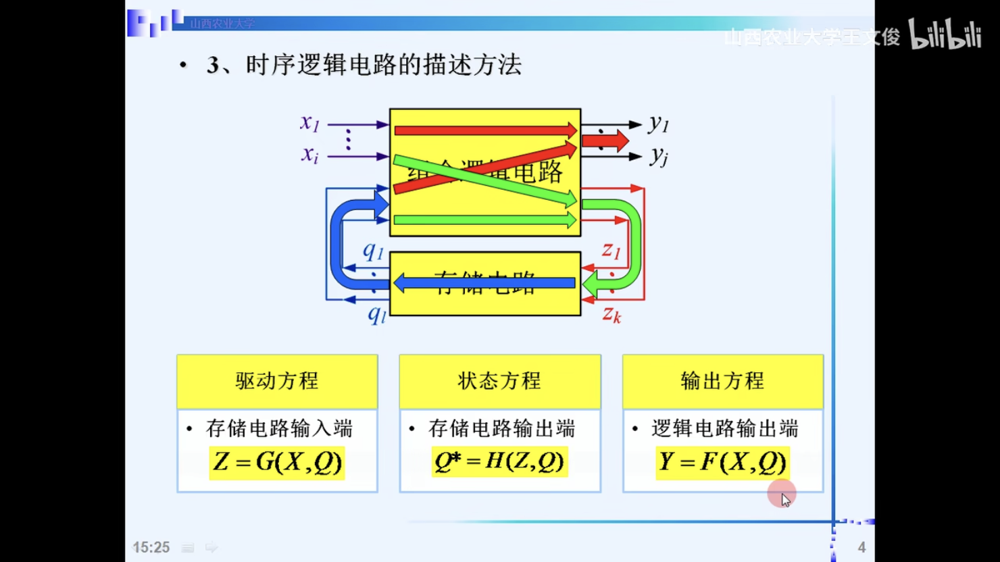
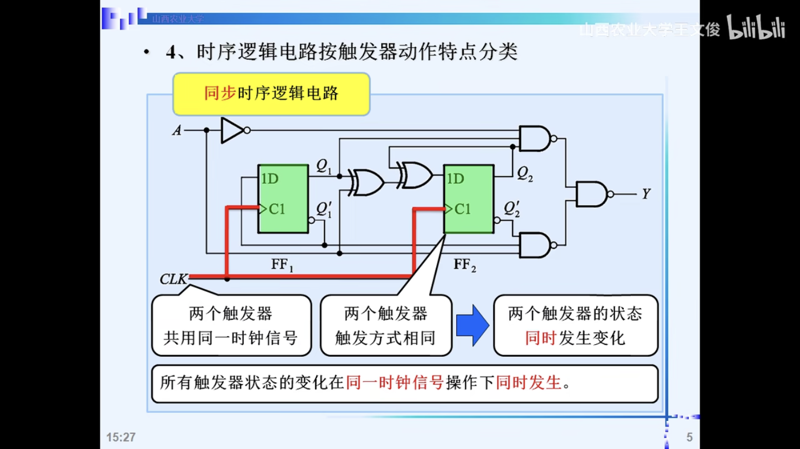
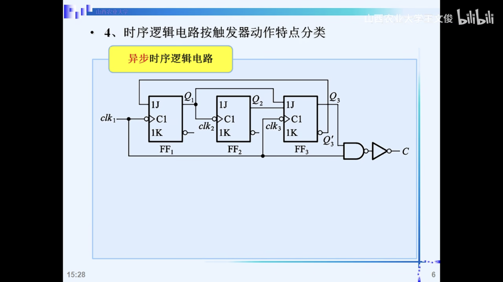
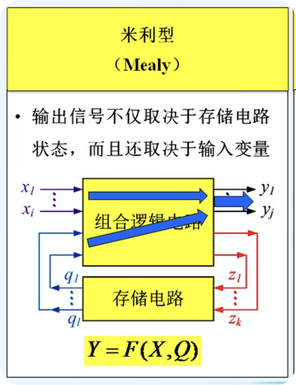
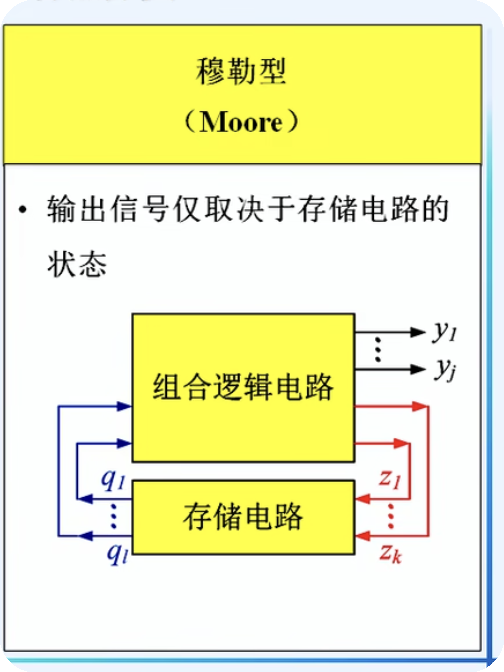
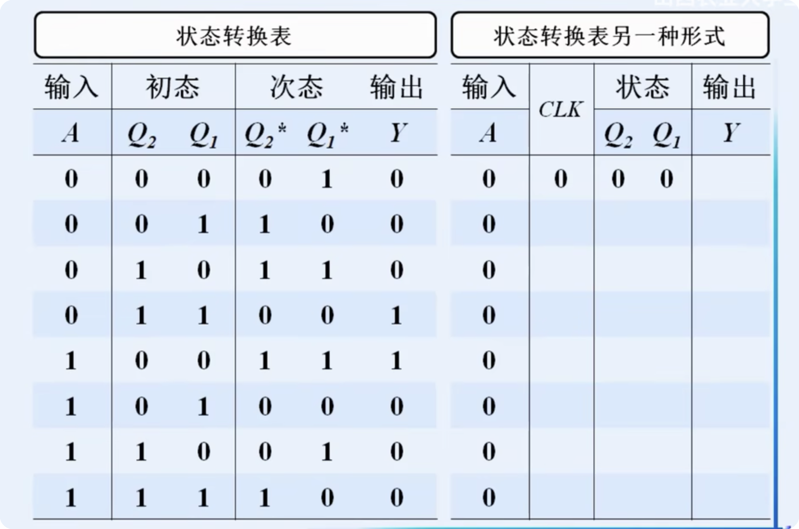
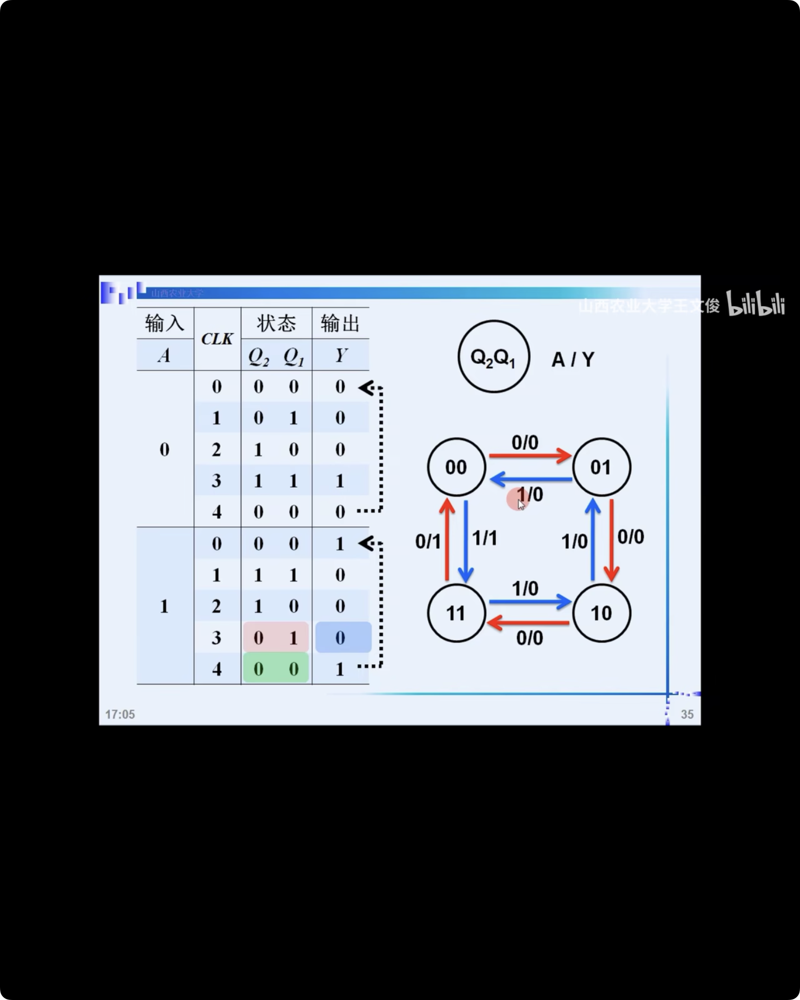
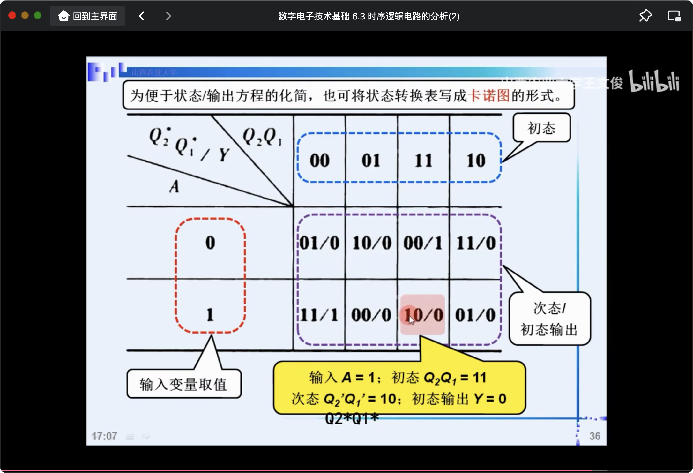
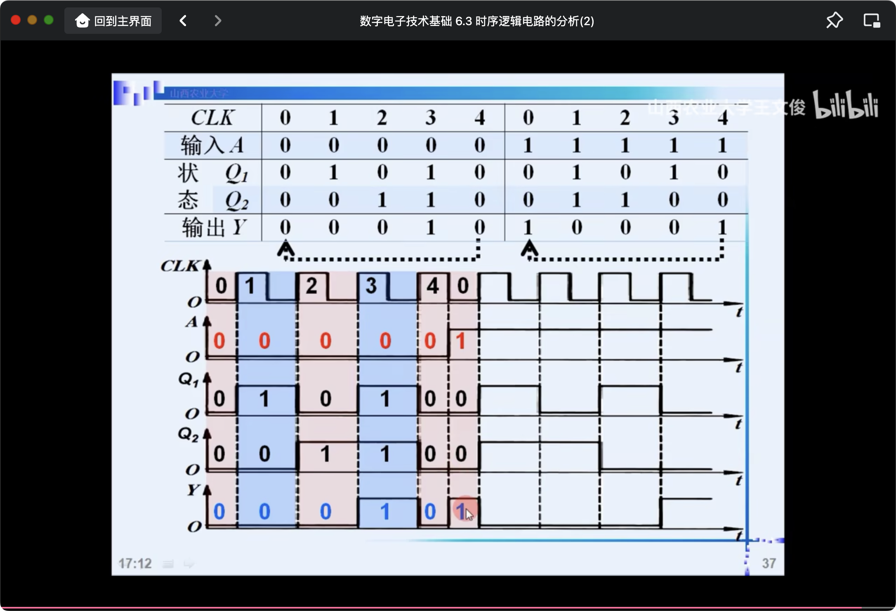

# 时序逻辑电路2

## 概述

三大方程:

- 驱动方程(激励方程): 关于 存储电路 输入端 的方程 $Z=G(X, Q)$
- 状态方程: 存储电路 输出端 $Q^{*}=H(Z, Q)$
- 输出方程: 逻辑电路 输出端 $Y=F(X,Q)$

### 按照 触发器 动作特点分类

1. 同步

两个触发器, 共用同一个时钟信号

两个触发器触发方式相同, 比方说都是posedge

=> 两个触发器的状态同时发生改变

2. 异步

这里: 三个触发器不是同一个时钟信号

### 按照 时序逻辑地哪路 输出信号 特点 分类

1. mealy: 输出信号 不仅取决于 存储电路状态, 还取决于 输入变量

$Y=F(X, Q)$

2. moore: 输出信号 仅取决于 存储电路的状态

$Y=F(Q)$

## 同步时序逻辑电路的分析

我们这里不分析: 异步 时序逻辑电路

分析步骤:

1. 分析 驱动方程(存储器的输入)(每个触发器输入信号的逻辑函数式) $Z=G(X, Q)$
2. 状态方程(存储器的输出) $Q^{*}=H(Z, Q)$
3. 输出方程(电路的输出) $Y=F(X,Q)$

### 例题

(TTL触发器, 允许输入端悬空, 悬空端=1)

### mealy例题

这里A为0/1要单独列出来, 分别推导 现太 与 次太

卡诺图形式的状态转换表

时序图的形式

