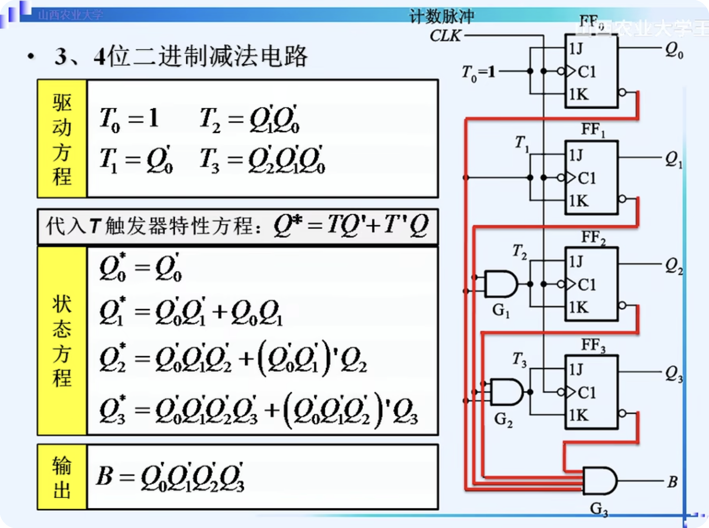
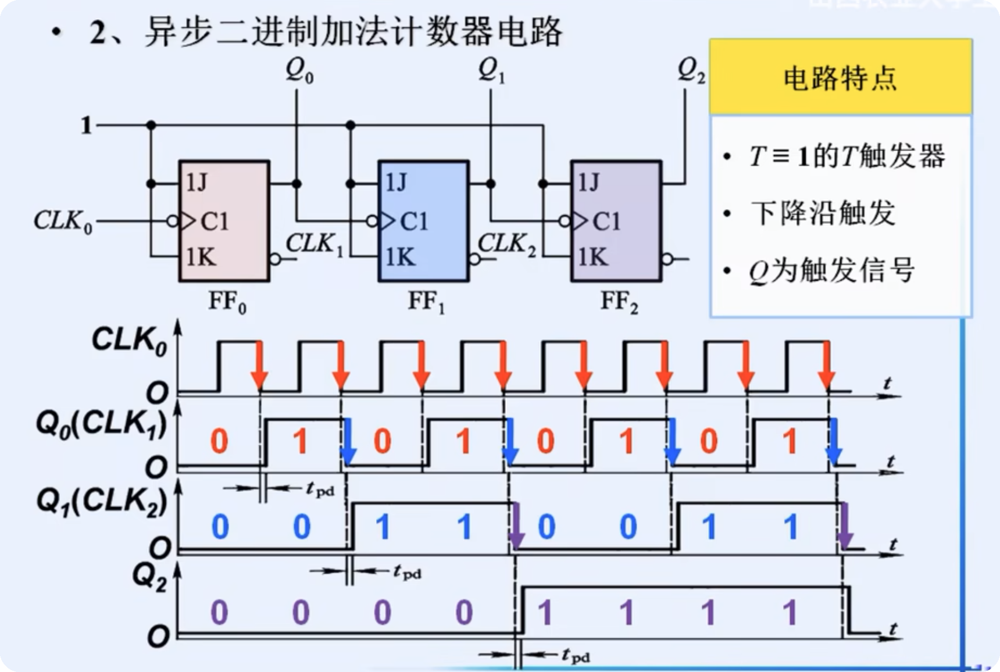
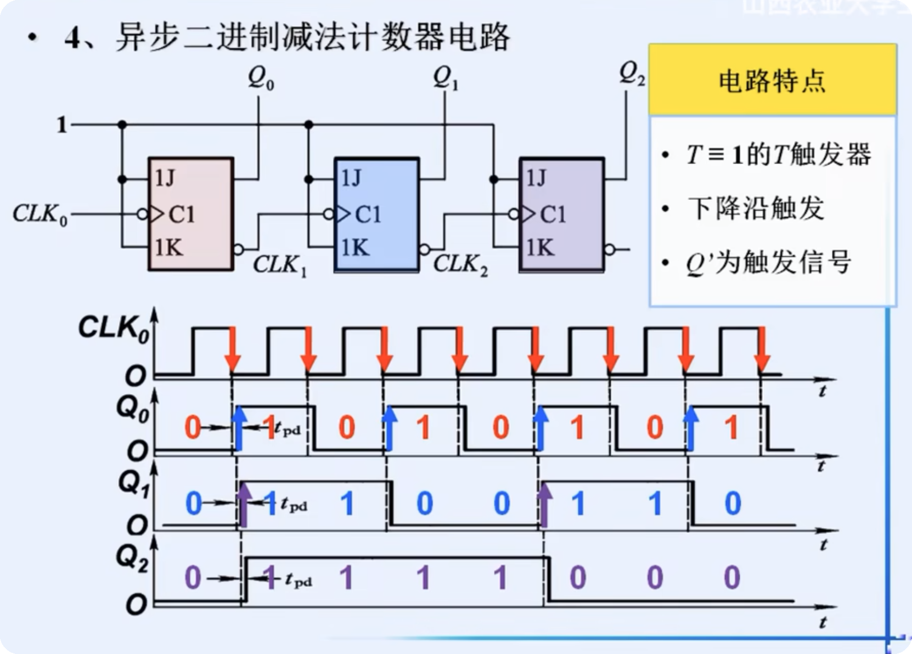
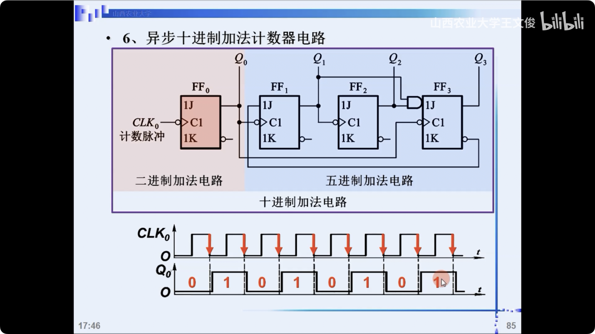
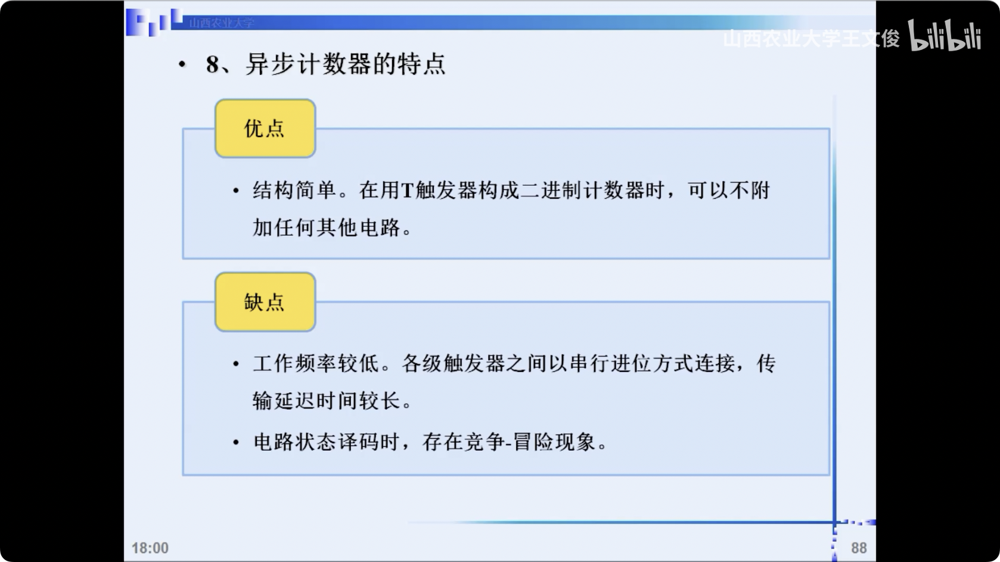

# 计数器

### 分类

- 时钟
  - 同步
  - 异步
- 容量
  - 十进制
  - 六十进制
- 计数增减
  - 加法
  - 减法
  - 可逆
- 数字编码
  - 二进制
  - BCD码
  - 格雷码(循环码)

### 同步二进制加法计数器

我们会用到T触发器

一定要记住JK触发器的特征方程

$Q^{*} = J\bar{Q} + \bar{K}Q$

T触发器, 则有

对应的T=1的时候, 发生翻转; T=0的时候, 保持状态

### 减法计数器

第i位是否发生状态翻转, 要看下面的位是否全为0

三大方程:

状态转移图:

## 异步计数器

### 异步加法计数器(二进制)

发现我们的持续时间, 变成了原来的两倍,
也就对应于进位的时间

### 异步减法计数器(二进制)

### 异步减法计数器(十进制)

### 异步计数器的特点

## 移位寄存器型 计数器

在移位寄存器基础上, 加上 反馈逻辑电路, 即可构成计数器
